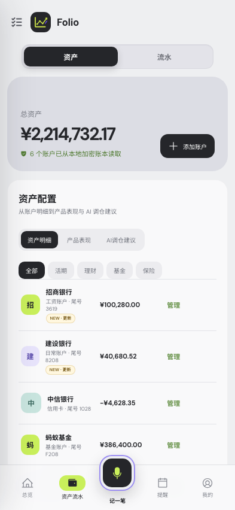

# Folio — Private Finance Organizer

[中文说明](./README.md)

Folio is a mobile-first private finance organizer for accounts, holdings, cashflow, reminders, and planning. Every high-risk money action follows a strict parse → review → explicit confirmation flow. AI can organize information and create review drafts, but it cannot write directly to the confirmed ledger.



## What changed in this update

- Combined Assets and Cashflow into one primary “资产流水” destination.
- Added a refined two-segment control for switching between the two views.
- Preserved account management, product performance, AI rebalancing suggestions, cashflow trends, and append-only ledger functionality.
- Replaced the bottom “AI 管家” destination with a new “我的” profile page.
- Added entry points for app password and biometrics, local data, import/export, QQ Mail, and preferences.
- Kept the assistant available as “我的助手” inside the profile page, while the centered capture action remains persistent.

## Core capabilities

- Mobile-first assets, cashflow, reminders, and AI-assisted capture
- Local encrypted ledger with explicit confirmation boundaries
- Account, holding, valuation, and product-operation management
- Income, expense, transfer, import, revision, and safe reversal flows
- Voice, screenshot/PDF, Markdown, CSV/TSV/XLSX ingestion
- Financial reminders, planning simulations, and read-only QQ Mail bills
- React web previews, Tauri desktop/mobile shell, and a separate WeChat mini-program runtime

## Tech stack

- React 19 + Vite 6
- Tauri 2
- Recharts
- Phosphor Icons
- Node.js native test runner
- Rust / SQLite native services

## Quick start

Node.js 20+ and npm are required.

```bash
npm ci
npm run dev
```

Open the native workspace preview with fictional data:

```text
http://127.0.0.1:5173/?vault-preview=native-film
```

The development-only `screen` query opens the updated views directly:

```text
?vault-preview=native-film&screen=assets
?vault-preview=native-film&screen=cashflow
?vault-preview=native-film&screen=profile
```

## Build and test

```bash
npm run build
npm test
node --test tests/mobile-shell.test.mjs
npm run test:privacy
```

Common Tauri commands:

```bash
npm run tauri:dev
npm run tauri:build
npm run mobile:doctor
```

## Project layout

```text
src/                  React app, domain logic, and local data adapters
src-tauri/            Tauri/Rust native capabilities
apps/wechat-mini/     WeChat mini-program runtime
services/folio-bff/   Local and staging BFF
tests/                Domain, privacy, mobile, and packaging tests
public/assets/        Brand, icon, and companion assets
```

## Data and security

- Only fictional fixtures belong in the repository. Never commit real financial data or credentials.
- Browser local mode fails closed and never silently falls through to demo data.
- AI, voice, files, and email can create review proposals only.
- The confirmed ledger is append-only; revisions and reversals create compensating events.
- Biometrics are a convenience layer, with the app password retained as the fallback.

## Design quality

This update uses the supplied mobile UI image as its visual source of truth. Assets, cashflow, and profile states were compared at a 393 × 852 viewport. See [design-qa.md](./design-qa.md) for the verification record.

## License

This is currently a private project and does not declare an open-source license.
