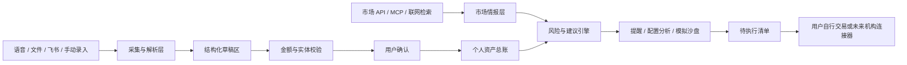

# Folio 顶层技术方案（历史讨论稿）

> 当前正式技术蓝图见 [`docs/03_TECHNICAL_BLUEPRINT.md`](docs/03_TECHNICAL_BLUEPRINT.md)；本文保留为历史讨论背景。

> 当前实施架构、安全边界和发布要求以 [`docs/TECHNICAL_DESIGN.md`](docs/TECHNICAL_DESIGN.md) 与 [`docs/SECURITY_MODEL.md`](docs/SECURITY_MODEL.md) 为准。

## 1. 推荐方向

Folio 不适合从“连接所有银行”起步。更稳妥的路线是：

1. 先建立统一、可审计的个人资产总账。
2. 用飞书多维表、Markdown/CSV/PDF、图片和语音解决 80% 的数据录入。
3. 所有 AI 识别结果先进入草稿区，经用户逐项确认后再写入总账。
4. 市场数据和个人数据分层处理，市场变化只生成提示，不直接触发交易。
5. 银行连接器按机构逐个增加，始终保留手动与文件导入兜底。

这条路线能尽快形成可用产品，也能避免银行接口不可得时整个项目停摆。

## 2. 顶层架构

核心原则：AI 可以建议、抽取和归类，但不能绕过确认直接修改真实资产。

## 3. AI 接入方案

### 3.1 模型适配层

前端不要直接依赖某一家模型的请求格式。建议建立统一的 `ModelProvider` 接口：

- OpenAI-compatible API
- 企业 AI 网关
- 本地模型（如 Ollama）
- 后续其他云模型

每种任务单独配置模型：

- 语音转写
- 文档 OCR / 多模态理解
- 结构化信息抽取
- 财务分析与对话
- 联网检索后的总结

金额识别必须使用 JSON Schema / 结构化输出，并记录：

- 原始文本
- 识别值
- 币种与单位
- 置信度
- 原文证据位置
- 用户修改记录

### 3.2 API Key

不建议网页直接扫描电脑环境变量。浏览器无法安全访问宿主机环境，而且把密钥交给前端也容易泄漏。

桌面端建议采用以下优先级：

1. 系统钥匙串：macOS Keychain、Windows Credential Manager、Linux Secret Service。
2. 环境变量白名单检测：只检测 `OPENAI_API_KEY` 等明确名称是否存在，不遍历或展示全部环境变量。
3. 检测到后先展示“发现可用配置”，用户明确同意后才导入。
4. 团队版可由服务端 AI Gateway 托管密钥，客户端只持有用户会话令牌。
5. 高隐私用户可选择本地模型，文档与总账不离开设备。

桌面包装建议优先评估 Tauri：体积较小，并能通过原生命令访问钥匙串、文件系统和白名单环境变量。若团队更熟悉 Node 生态，也可以使用 Electron。

## 4. 数据接入分层

### 4.1 个人资产数据

第一阶段：

- 手动录入
- 语音补录
- 飞书多维表导入/周期同步
- Markdown、CSV、Excel、PDF、图片导入
- 银行账单和保险文件解析

第二阶段：

- 邮件账单连接器
- 支持导出的银行流水/持仓文件
- MCP 或用户自建 API

第三阶段：

- 与有正式开放能力的银行、券商或聚合服务商逐家对接
- 只读连接优先，交易执行保持在机构官方应用

不建议早期依赖模拟登录、读取银行 App 或长期 RPA。它们稳定性、合规性和凭证安全风险都较高。

### 4.2 市场与企业信息

市场数据单独进入“市场情报层”，不能直接覆盖个人持仓：

- 行情、基金净值、指数、黄金与利率数据：使用有明确授权和更新频率的 API。
- 企业背景、风险事件：可接企业信息服务。
- 联网搜索：只用于补充新闻和事件线索，必须保存来源、时间和可信度。
- MCP：适合作为连接器协议，但每个 MCP 仍需要权限范围、超时、审计与数据来源标记。

任何“清仓”“买入”措辞默认降级成关注提示，并展示依据与数据时间。

### 4.3 统一资产模型

建议先定义稳定的领域对象：

- `Institution`：银行、基金平台、保险公司
- `Account`：账户与尾号
- `Product`：活期、定期、理财、基金、保险、房产
- `Position`：持仓数量、市值、成本、估值时间
- `Transaction`：收入、支出、申购、赎回、转账
- `Obligation`：租金、保费、到期、分红、定投
- `Document`：原始文件、解析版本和证据
- `DraftChange`：AI 生成、待确认的资产变更
- `Reminder`：触发规则、渠道和处理状态
- `MarketSignal`：来源、时间、影响资产和可信度

总账推荐使用事件记录而不是直接覆盖余额。余额是事件汇总结果，因此每次语音修改都能追溯和撤销。

## 5. 处理流水线

一条语音或文件进入系统后的标准流程：

1. 保存原始输入并计算文件指纹。
2. ASR / OCR / 文档解析。
3. 抽取机构、产品、金额、日期和动作。
4. 单位归一化，例如“五万”“5w”统一为 `50000.00 CNY`。
5. 与现有机构、账户和产品实体匹配。
6. 检测重复记录、资金不守恒和异常金额。
7. 生成简短核对清单。
8. 用户确认或修改。
9. 写入事件总账并重新计算资产视图。
10. 生成提醒、配置变化和审计记录。

关键校验包括：

- 借贷/转账两端轧差
- 币种与单位
- 日期和到账日
- 产品名称歧义
- 重复导入
- 大额阈值
- 低置信度字段强制确认

## 6. 推荐技术栈

- 前端：现有 React + Vite，图表继续使用 Recharts。
- 桌面端：Tauri 或 Electron。
- 本地数据：SQLite；需要加密时使用 SQLCipher 或等价方案。
- 云同步：可选 Supabase/Postgres，采用行级权限和端到端敏感字段加密。
- 后端/BFF：TypeScript 服务，负责模型适配、市场数据缓存、任务队列和连接器鉴权。
- 文件存储：对象存储；原文件、解析产物和总账记录分开保存。
- 后台任务：用于净值更新、提醒、文档解析和连接器同步。
- 可观测性：每次 AI 调用记录模型、提示版本、输入哈希、结构化结果、耗时和用户修正，但不记录明文密钥。

## 7. 最大难点

1. 银行数据可得性：不同机构能力不一致，必须有导入兜底。
2. 金额准确性：需要确定性校验、证据引用、版本记录和人工确认。
3. 产品实体匹配：同一产品可能存在简称、渠道名和份额类别差异。
4. 市场数据时效：所有建议必须显示数据时间，过期数据不能伪装成实时。
5. 保险文档复杂：缴费、现金价值、分红和免责条款需要分字段证据。
6. 隐私与密钥：桌面端、本地模型和云同步之间要允许用户选择。
7. 提醒可靠性：浏览器、桌面和移动推送需要统一幂等与去重机制。

## 8. 建议里程碑

### M1：可信手工总账

- 手动、语音、Markdown/CSV 导入
- 草稿确认与撤销
- 资产、流水、提醒、模拟沙盘

### M2：飞书与文档自动化

- 飞书多维表映射与增量同步
- PDF/图片/保险文件解析
- 本地钥匙串与模型适配层

### M3：市场情报

- 基金净值和主要市场指标
- 持仓穿透、波动提示和来源时间
- AI 调仓建议只进入模拟沙盘

### M4：机构连接器

- 邮件账单和标准导出文件
- 可获得授权的银行/券商只读 API
- 多设备加密同步与家庭协作
