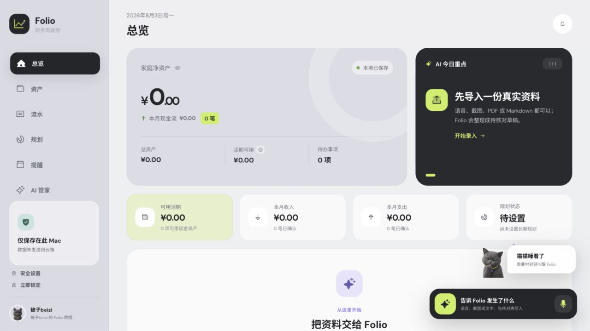
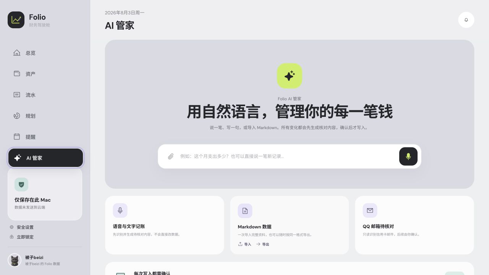
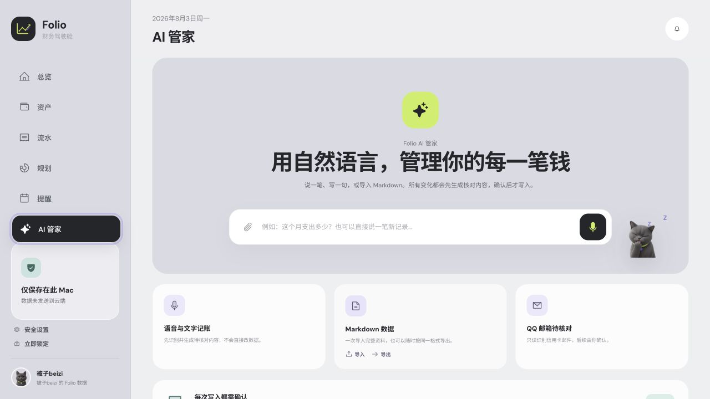
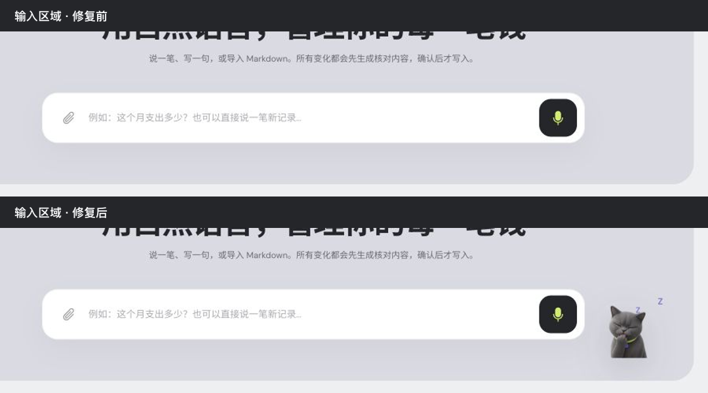
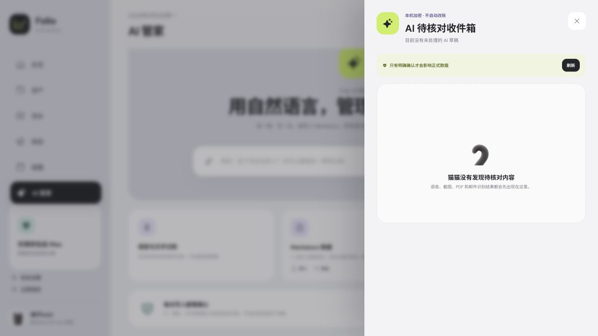
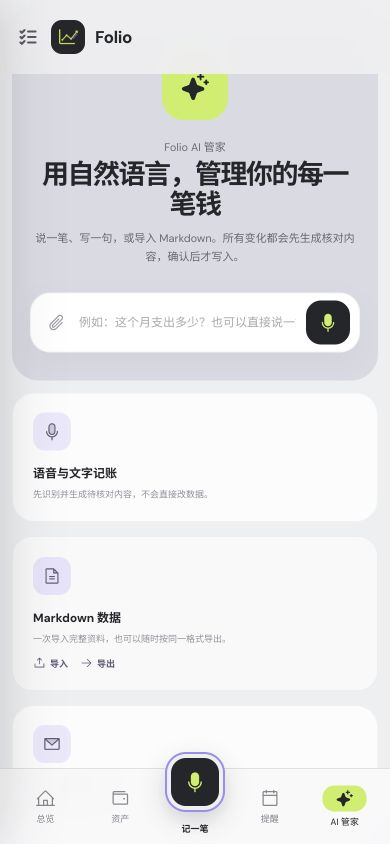

# Folio 产品化与 MVP 就绪度审计

日期：2026-08-02  
结论：**当前浏览器链接是产品预览；仓库本身已有真实的本地前后端，但整体仍是工程 Alpha / 本地 MVP 候选，不是可交付 MVP。**

## 一、这次修复了什么

AI 管家此前通过页面条件分支明确排除了桌宠，所以切页后必然消失。本次把同一套桌宠状态机放回 AI 管家的页面内语音框旁边：桌宠和输入动作属于同一个交互区域，不再叠加第二个悬浮语音框，也不会盖住财务内容。

### 1. 总览页桌宠基线 — 健康

桌面总览中的透明猫素材、右下角锚点和输入入口均正常，说明素材与桌宠组件本身没有丢失。

### 2. AI 管家修复前 — 有明确缺陷

语音框存在，但右侧没有桌宠。问题不是图片加载失败，而是 AI 管家页面没有渲染桌宠组件。

### 3. AI 管家修复后 — 通过

猫位于输入框右侧的专属空白区，保留透明画布与安静休息状态；页面标题、能力卡和确认防线没有被遮挡。

局部前后对比：

### 4. 桌宠主交互 — 通过

点击猫会打开“AI 待核对收件箱”，不会绕过核对流程直接修改资产或账本。

### 5. 手机端一致性 — 通过

390 × 844 下没有横向溢出；AI 管家页面内语音框和底部居中的“记一笔”同时保留。手机端不加载桌面桌宠运行时，以避免遮挡和无意义的动画开销。

## 二、它现在到底是 Demo 还是产品

要分两层看：

| 层次 | 当前状态 | 判断 |
| --- | --- | --- |
| 浏览器 `?vault-preview=workspace` | 使用 `VaultWorkspacePreview` 和内存快照；语音、导入、确认等部分动作是预览适配器模拟 | **是产品 Demo / UI 验证环境** |
| macOS Tauri 应用 | React 界面调用 Rust 命令，本地 SQLCipher 持久化；账户、流水、持仓、提醒、规划、AI 草稿、导入导出、清除和 QQ 邮箱连接器都有真实命令面 | **不是纯前端 Demo，已有真实本地前后端** |
| 当前发布状态 | 自动化核心闭环通过，但真实外部服务、人工验收、签名公证、真机和中断恢复未闭环 | **工程 Alpha / MVP 候选，不是可交付 MVP** |

Folio 是本地优先产品。这里的“后端”可以是随 App 一起运行的 Tauri/Rust + SQLCipher，并不需要为了看起来像“完整前后端”而额外搭一个云服务器。第一期如果只做 AI 模型与只读 QQ 邮箱，继续保持本地数据为主更符合当前产品方向。

## 三、已经真实具备的部分

- 新应用从空数据开始；结构化 Markdown 可解析为账户、持仓、流水、提醒和规划草稿。
- 高风险动作走“解析 → 核对 → 明确确认”，确认前不写账。
- 本地 SQLCipher 数据库、不可变流水、持仓操作、提醒、规划和草稿收件箱已经存在。
- Markdown 导出、需密码二次确认的一键清除、备份恢复命令面已经存在。
- OpenAI Provider 与只读 QQ Mail IMAP 连接器已有后端实现；密钥/授权码走系统 Keychain。
- 自动化结果：JavaScript `222/222`、Rust `98/98`（另 2 项需发布环境而忽略）、移动壳层 `9/9`、Sites Worker `4/4`，生产构建通过。

## 四、成为 MVP 还缺什么

### P0：定义内的 MVP 阻断项

1. **在真实打包的 macOS App 完成 8 项人工验收。** Touch ID 与密码回退、重启解锁、真实数据导入对账、重复导入、备份恢复、可读导出与清理、干净安装/升级、强退恢复目前都还没有人工签字证据。
2. **给整批 Markdown 导入增加持久恢复点。** 当前按领域分组提交，中途不会静默继续，但应用中断后还缺少可靠的继续、回滚或对账入口。这是“一次性导入完整资料”能否放心交付的关键。
3. **完成真实 OpenAI 联调。** 需要验证真实 Key、超时、401/429、结构化输出异常、隐私日志、逐次外发同意，以及失败时不生成可确认脏草稿。
4. **完成真实 QQ 邮箱联调。** 用专用测试邮箱验证授权码、只读打开、白名单/主题过滤、UID 游标、重复扫描、授权撤销、文件夹/TLS 异常，并用脱敏银行样本补齐解析。
5. **用真实但不入库的个人样本做闭环对账。** 验证导入后的余额、持仓、提醒和规划；再做导出 → 清除 → 重启 → 重新导入的回环测试。
6. **补齐崩溃、迁移和升级恢复。** 数据库迁移、确认过程强退、损坏备份、磁盘空间不足等失败场景要有可恢复状态和用户可理解的错误。

### 如果 MVP 要交给其他 Mac 用户

还必须补齐完整 Xcode、Developer ID 签名、Apple 公证、Gatekeeper 验证，以及干净机器安装/升级测试。当前 DMG 是可验证的开发包，但为 ad-hoc 签名且未公证。

### 如果“移动端”也算第一期 MVP

目前不能算完成：缺完整 Xcode/iOS SDK/Simulator、CocoaPods、JDK、Android SDK/ADB，也没有 iOS/Android 原生工程包与真机证据。至少要在真机验证应用密码、生命周期锁定、SQLCipher、麦克风与端侧识别、文件选择/OCR、通知权限和强退恢复。

## 五、可放到 MVP 之后

- AI 一次输入生成多条提案后的批量核对、恢复原核对页面与更高效的收件箱处理。
- 主包路由拆分；当前构建通过，但主 bundle 约 1.28 MB，仍有性能警告。
- 更广的银行邮件模板、IMAP 依赖升级、更多文件格式和云同步。
- 不含财务明文的诊断日志、可选匿名稳定性指标，以及更完整的读屏/键盘/辅助功能人工验收。

## 六、审计边界

- 截图审计覆盖 1280 × 720 桌面与 390 × 844 手机 CSS 视口；前后对比使用同一浏览器和同一设备像素密度。
- 自动化证明命令、数据规则和构建可运行，不等于真实邮箱、真实模型、Apple 公证或真机已经通过。
- 当前浏览器预览不能用来判断 SQLCipher 持久化是否正常；此类结论必须来自原生 Tauri 包。

**建议的里程碑名称：`macOS 本地自用 MVP 候选`。完成上述 P0 后，再标记为 `macOS 本地自用 MVP`；完成签名、公证和干净机验收后，才进入对外测试。**
