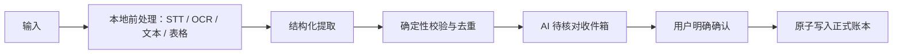

# Folio 技术蓝图

> 版本：1.0  
> 更新：2026-07-30  
> 目标：用尽量少的技术组件，实现可信的多模态录入与本地账本。

## 1. 推荐架构结论

- **继续使用 React + Tauri 2，不立即迁移 React Native。**
- React 负责共享界面，Rust 负责账本、加密、校验和本地数据。
- iOS/macOS 的语音、OCR、文件选择、通知和钥匙串通过 Swift 原生插件接入。
- Android 后续通过 Kotlin 原生插件接入对应能力。
- 外部 AI 是可替换的解析器，不是数据库，也没有直接写账权限。

原因：当前项目已经有 React 界面、Rust 领域逻辑、SQLCipher、macOS 包和测试。迁移 React Native 会重写界面，并为 Rust/SQLCipher 再做一套 Native Module 桥接；对现阶段收益不够高。

## 2. “统一 AI 收件箱”是什么

它不是邮箱，也不是另一个 AI 模型，而是所有自动识别结果共同进入的**待核对队列**。

每个收件箱项目至少保存：

- 来源类型和来源指纹；
- 原始证据的安全引用；
- 处理状态：处理中、需补充、待核对、疑似重复、已确认、已拒绝；
- AI 提取的字段和每个字段的证据位置；
- 置信状态、缺失字段和校验错误；
- 用户修改记录和最终确认结果。

它解决五个问题：

1. AI 或 OCR 需要时间时有明确的处理中状态；
2. 一段语音、一封日报或一份 PDF 可拆成多条记录；
3. 所有输入使用同一个核对体验；
4. 重复、缺字段和低置信内容不会污染正式账本；
5. 桌宠只能提示“已准备好核对”，不能暗示已经入账。

## 3. 多模态处理流水线

不同输入需要不同的前处理，但最后都输出同一套结构化草稿。

| 输入 | 首要处理 | 是否需要 OCR | AI 的作用 |
|---|---|---:|---|
| 纯文字/Markdown | 文本解析 | 否 | 提取账户、金额、日期、方向 |
| CSV/TSV/XLSX | 确定性表格解析 | 否 | 仅辅助字段映射和异常说明 |
| 可选中文本 PDF | 本地文本提取 | 通常否 | 理解表格、条款和记录边界 |
| 扫描 PDF | 页面渲染 + OCR | 是 | 结合布局提取记录与提醒 |
| 截图/照片 | OCR + 图像方向/裁切 | 是 | 理解商户、金额、日期和版式 |
| 语音 | 设备内 STT 转文字 | 不适用 | 将转写文本变成结构化草稿 |
| QQ 邮件 | MIME/HTML + 模板解析 | 附件视情况 | 模板失败时辅助结构化，不直接入账 |

推荐流水线：



### PDF 的判断

- 先检测是否存在可用文本层；
- 有文本层时优先本地提取，不重复 OCR；
- 没有文本层或文本质量太低时，把页面渲染为图像后 OCR；
- 混合 PDF 可同时保留文本块与页面坐标；
- 只有需要理解复杂表格、版式或跨页关系时才调用视觉模型。

### 语音的判断

语音必须先转成文字，再做财务结构化提取。语音识别模型和财务理解模型是两种能力；它们可以来自同一供应商，也可以完全分开。

## 4. Apple 与非 Apple 语音方案

### Apple

不是只有“录音授权”。完整链路包含：

1. 用户每次主动触发录音；
2. 请求麦克风权限；
3. 请求系统 Speech Recognition 权限；
4. 使用系统的设备内识别能力；
5. 仅把转写文字交给后续解析；
6. 原始音频只存在内存中，不落盘、不上传。

若当前语言或设备不支持离线识别，财务场景应安全失败，并提示改用文字或文件输入，不能静默回退云端转写。

### Android

Android 不是复用 Apple 组件，而是使用系统的 `SpeechRecognizer` 设备内接口，并检查设备是否支持。需要麦克风权限；若离线识别不可用，同样失败关闭。

一期建议先完成 iPhone/macOS 真机闭环；Android 放入第二期，但在一期先保留统一的 `SpeechProvider` 接口，避免以后改业务层。

### Web

浏览器的语音实现和隐私保证差异较大，不能默认宣称设备内识别。Web 首期保留文字/文件入口；若未来启用云端转写，必须单独说明并取得用户明确同意。

## 5. 模型与提供器设计

首期不需要同时采购很多模型。需要的是三类能力接口：

```text
SpeechProvider      语音 → 文字
DocumentProvider    图片/PDF → 文本与坐标证据
ExtractionProvider  文本/图像证据 → 财务草稿 JSON
```

首期默认组合：

- SpeechProvider：操作系统设备内识别；
- DocumentProvider：Apple PDFKit/Vision 或 Android 本地 OCR；
- ExtractionProvider：一个支持结构化输出的多模态 AI 提供器；
- 确定性解析器：表格、QQ 邮件模板、金额和日期规则。

模型返回必须符合版本化 JSON Schema。应用随后执行本地校验；模型的“置信度”不能代替金额规则和用户确认。

## 6. 本地 API Key 与多提供器测试

本地开发版可以读取不同 API Key 做测试，但应使用**明确的白名单变量名**，不能扫描全部环境变量。

示例：

```dotenv
FOLIO_AI_PROVIDER=openai
FOLIO_OPENAI_API_KEY=
FOLIO_GEMINI_API_KEY=
FOLIO_ANTHROPIC_API_KEY=
```

安全边界：

- 仅原生 Rust 层在启动时读取密钥；
- 密钥不传给 React、不写日志、不写数据库；
- 只启用当前选择的提供器；
- 测试使用虚构或脱敏 fixture；
- 比较结构有效率、字段正确率、证据覆盖、耗时和成本；
- 真实发布版由用户在设置中填写，并存入 Keychain/Keystore。

注意：从 Finder 启动的 macOS App 通常不会可靠继承终端的 shell 环境变量。因此环境变量适合开发测试，不适合作为正式用户的唯一配置方式。

## 7. QQ 邮箱信用卡邮件

实现状态（2026-07-30）：Rust/SQLCipher/Keychain/React 链路与自动化测试已完成；真实 QQ 账户登录和多银行脱敏模板验收仍待执行。具体结果见 `docs/06_ACCEPTANCE_RESULTS.md`。

### 推荐接入

- 使用 QQ 邮箱 IMAP 专用授权码，不收集 QQ 登录密码；
- 连接器只执行搜索和读取，不执行标记、移动或删除；
- 用户显式选择文件夹、发件人和银行白名单；
- 保存增量游标和消息指纹；
- 邮件正文先走确定性模板解析；
- 附件按 PDF/图片流水线处理；
- 结果只进入 AI 收件箱。

### 去重键

优先使用邮箱消息 ID；同时对“发卡行、卡尾号、交易时间、金额、商户、邮件内容哈希”生成来源指纹。重复拉取只更新处理状态，不再生成正式流水。

退款、撤销和冲正必须作为独立候选事件，并与原交易建立关联，不能直接覆盖原记录。

## 8. 本地数据与金额规则

### 存储

- SQLCipher：账户、流水、事项、收件箱元数据、来源与审计记录；
- Keychain/Keystore：保险库密钥包装材料、用户保存的 API Key；
- 临时目录：文件解析过程，完成或取消后清理；
- 加密备份：用户主动导出和恢复；
- 云端：一期不依赖。

### 首期最小金额规则

复杂会计规则不出现在产品 Brief，但以下规则不能省略：

1. 人民币金额以“分”的整数存储，禁止浮点计算；
2. 只有 `confirmed` 记录参与汇总；
3. 收入为正、支出为负，转账由同一事务内的一出一入组成；
4. 账户余额已经包含账户内产品价值时，持仓不能再被重复加总；
5. 更正使用新的可追溯事件，不能静默覆盖历史；
6. 导入与邮件处理必须幂等；
7. 写入账本、更新余额和标记收件箱确认必须原子提交。

多币种、汇率来源、未折算资产和跨币种损益延后到第三期。

## 9. React Native 还是 Tauri 2

### 当前推荐：继续 Tauri 2

Tauri 2 能复用现有 React 界面和 Rust 金额核心，并允许 iOS 用 Swift、Android 用 Kotlin 实现原生插件。它最符合当前“macOS 已能运行、移动端继续完善”的项目状态。

### React Native 的优势

- 移动生态成熟，原生组件和第三方库较多；
- 适合从零开始、移动端优先、交互非常原生化的产品；
- React 团队更容易招聘。

### 对本项目的成本

- 现有 React Web 界面需要重写或大幅适配；
- Rust、SQLCipher 和安全能力仍要通过 Turbo Native Module/FFI 桥接；
- macOS/Web 会形成另一套壳层和发布路径；
- 当前最重要的准确性闭环不会因此自动变简单。

### 决策门

先做一个 1 周 Tauri iPhone 真机技术验证，必须同时通过：

- 密码解锁与 SQLCipher；
- 设备内语音和失败关闭；
- 选图/PDF 与本地 OCR；
- 本地通知；
- 前后台切换与自动锁定；
- 一次完整的核对确认写账。

全部通过则继续 Tauri。若出现无法接受的稳定性、性能或系统能力阻碍，再评估“React Native 移动壳 + 复用 Rust 核心”，而不是推倒重写整个产品。

## 10. 开发顺序

1. iPhone 真机技术验证；
2. 持久化 AI 收件箱和多记录草稿；
3. QQ 邮箱只读连接器与模板测试；
4. 多模态解析路由与提供器测试台；
5. 人民币账本、提醒、备份的端到端回归；
6. 私人测试后再决定 Android、同步与高级分析。

## 11. 关键风险

- 离线语音/OCR 的语言与设备覆盖有限；
- 邮件模板会变化，必须保留证据和人工核对；
- AI 输出格式正确不等于事实正确；
- 手机上的文件路径、后台任务和通知权限需要真机验证；
- 外部 API Key 可能泄漏，必须隔离在原生密钥层；
- 跨设备同步会显著增加冲突和密钥管理复杂度，因此不进入一期发布门。

## 12. 官方技术依据

- Apple Speech：[SFSpeechRecognizer](https://developer.apple.com/documentation/speech/sfspeechrecognizer) 与 [supportsOnDeviceRecognition](https://developer.apple.com/documentation/speech/sfspeechrecognizer/supportsondevicerecognition)
- Android Speech：[SpeechRecognizer](https://developer.android.com/reference/android/speech/SpeechRecognizer)
- Tauri 2 移动原生插件：[Developing Mobile Plugins](https://v2.tauri.app/develop/plugins/develop-mobile/)
- React Native 原生能力桥接：[Turbo Native Modules](https://reactnative.dev/docs/turbo-native-modules-introduction)
- OpenAI 文件输入：[File inputs](https://developers.openai.com/api/docs/guides/file-inputs)
- OpenAI 结构化输出：[Structured Outputs](https://developers.openai.com/api/docs/guides/structured-outputs)
- OpenAI 实时转写：[Realtime transcription](https://developers.openai.com/api/docs/guides/realtime-transcription)
