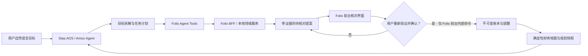

# Folio × STEPX Neo 共创提案

更新：2026-08-12  
活动：2026 年 8 月 15–16 日，成都，STEPX Neo 智能终端闭门共创  
定位：**不是把聊天机器人装进手机，而是给智能终端补上一套可验证、可持续、不过权的个人财务组织能力。**

## 一句话提案

> **Folio 是智能终端里的个人财务组织 Agent：用户只需说出刚刚发生的变化，Agent 会拆解任务、整理证据、等待确认，并持续把流水、提醒和可规划资金维护成一张清楚的财务地图。**

## 为什么值得在智能终端上做

普通用户的首要问题通常不是账户太多，而是财务信息产生得太碎：刚付了一笔钱、收到一笔收入、想到一个缴费日期，往往都因为“以后再记”而丢失。传统记账要求用户先打开 App、选账户、选分类、填金额和日期；通用聊天助手又无法可靠维护一份可审计账本。

智能终端提供了三件手机 App 单独难以持续完成的事：

1. **随时接住意图**：在用户说出变化的当下启动，不要求先找到 Folio 页面；
2. **跨时间持续跟进**：把缴费、到期和闲钱检查变成有状态任务，而不是一次问答；
3. **调度专用能力**：终端 Agent 负责语音、计划和系统入口，Folio 负责财务语义、证据、确定性计算与确认。

真正的 Agent 闭环不是“听懂一句话”，而是：

`理解目标 → 拆解任务 → 调用 Folio 工具 → 遇到缺失信息时追问 → 前台核对 → 明确确认 → 持续提醒和复盘`

## 核心演示任务

用户对 STEPX Neo 说：

> 建行新增租金收入 8,000，8 月 20 日提醒我交保费 10,000，然后帮我看下这个月还有多少活钱可以规划。

Agent 应完成：

1. 识别这是“一笔收入 + 一个提醒 + 一个规划查询”的复合目标；
2. 调用 `folio.create_review_proposal`，只产生两个带原话证据的 `pending_review` 项；
3. 发现收入缺少具体日期时，使用今天作为待核对候选，而不是静默写账；
4. 调用 `folio.open_review`，前台展示逐项核对卡；
5. 用户只能在 Folio 自己的前台界面完成密码/生物识别和逐项确认；STEPX 工具注册表不包含任何确认或写账接口；
6. 确认完成后，终端只能重新读取 `folio.get_planning_snapshot`，从已确认账本和未来保费预留中确定性计算活期可用；
7. 返回金额、预留项和引用依据，不自动购买、转账或承诺收益。

演示中的主动跟进：终端在保费日前询问“是否仍按 10,000 元预留”，用户确认后更新本次提醒；如果用户未响应，账本不变，提醒保持待办。

## 90 秒现场脚本

| 时间 | 画面/动作 | 要证明的能力 |
|---|---|---|
| 0–10 秒 | 桌面散落着消费、租金和保费信息；用户无需打开表格，直接对终端说演示口令 | 低摩擦入口 |
| 10–25 秒 | STEPX Neo 显示任务计划：整理收入、创建提醒、查询活钱 | 目标理解与自主规划 |
| 25–45 秒 | Folio 核对卡分成 2 项，显示金额、日期和原话；缺失字段明确标出 | 证据与不幻觉 |
| 45–58 秒 | 用户只勾选正确项目并完成前台验证；Agent 无法后台确认 | 人机权限边界 |
| 58–72 秒 | Folio 地图出现“今日新增”；活期可用扣除保费预留并给出引用 | 真正完成任务 |
| 72–82 秒 | 手机端展示 8 月 20 日提醒；猫咪只提示“已整理，等你确认” | 跨端持续性与品牌记忆 |
| 82–90 秒 | 收束：把和钱有关的事情理得更顺、算得更清楚 | 产品定位 |

## 工具与权限设计

实现位于 `packages/folio-agent-tools`，目前使用协议中立的 JavaScript 适配层；主办方提供 Step AOS Skill 格式后，只替换传输/注册外壳。

| 工具 | 读写 | Agent 可自主调用 | 强制边界 |
|---|---:|---:|---|
| `folio.create_review_proposal` | 产生草稿 | 是 | 只能是 `pending_review`；每项有原文证据 |
| `folio.list_due_reminders` | 只读 | 是 | 最小化返回范围和数量 |
| `folio.get_planning_snapshot` | 只读 | 是 | 金额为确定性计算；必须返回引用和覆盖率 |
| `folio.open_review` | 只读导航 | 是 | 只能打开仍待核对的提案 |
| `folio.simulate_idle_cash_plan` | 只读模拟 | 是 | 明确标识 simulation；绝不触发真实交易 |

`confirm_selected_items` 仍可作为 Folio 应用内部领域命令存在，但不会进入 Step AOS/STEPX 的公开 Tool Registry。即使终端进程、模型或提示词被攻破，也拿不到确认写账、支付、转账、买卖或调仓能力。

## 只读信息来源与替代路径

终端权限遵循“看得到必要事实，但不能动钱”：

- **银行 App**：不接管无障碍、不模拟点击、不绕过禁止截图页面，不读取登录口令、验证码或支付确认；
- **短信信使**：仅在 Step AOS 明确提供用户逐项授权的只读消息能力时，按银行/卡组织白名单读取交易通知摘要，原短信只用于证据引用并进入待核对；
- **QQ 邮箱**：使用只读 OAuth/应用授权，限定信用卡账单发件人和标签，只取账单所需字段；不得发送、删除、标记已处理或扩大邮箱范围；
- **用户截图/PDF**：设备内提取文字和坐标证据；遇到银行禁止截图时停止，不提供绕过方案；
- **手工语音/文字**：始终可用作最低权限的补充入口。

所有来源最终只生成 `pending_review`。来源不可用、证据不足或字段冲突时，Agent 只能追问或放入异常收件箱，不能自行补值，更不能发起交易。

当前自动化已覆盖：伪造已确认状态、丢失证据、未知项目、后台确认、过期验证、重复请求和模拟越权。运行：`npm run test:agent`。

## 系统结构

终端可以规划、读取和调度前台页面；财务事实由 Folio 的领域规则验证；终端没有写账或交易工具。高风险写入始终由用户在 Folio 前台完成，真实支付、转账、买卖和调仓永不进入本方案的权限面。

## 与通用助手相比的差异

- **不是聊天记录，而是有状态任务**：提醒、账本和后续检查能够跨时间继续；
- **不是模型算钱，而是确定性规则算钱**：模型只负责理解，金额聚合、预留和余额影响由代码计算；
- **不是“听起来对”，而是可以追溯**：每个 AI 项目都引用语音/文字/截图证据；
- **不是默认替用户做主**：建议与真实交易分离，高风险动作不能后台执行；
- **不是只展示桌面端**：移动端负责随手采集/核对，桌面端负责全局地图与批量整理。

## 内部验收计分卡

这不是主办方公布评分规则，而是 Folio 的自检标准：

| 维度 | 通过条件 |
|---|---|
| 真任务完成 | 一句混合语音完整形成收入、提醒和规划结果，不靠人工后台改数据 |
| 持续理解 | 能记住提案与提醒状态，重新进入时不重复写入 |
| 自主规划 | 终端能自行选择 3 个以上 Folio 工具并按依赖顺序执行 |
| 系统能力 | 至少证明系统语音入口、前台深链、身份验证和提醒入口中的 3 项 |
| 可靠性 | 断网、模型幻觉、重复调用、用户取消时均 fail closed |
| 可解释性 | 每个写入项能回到原始证据；规划结果有计算引用 |
| 产品价值 | 非专业用户在 30 秒内理解“说一次、核对、长期成图” |

## 8 月 12–15 日里程碑

### 8 月 12 日：协议中立核心

- Agent 工具清单、权限元数据和适配器完成；
- 对抗测试完成；
- 微信小程序文字输入 → DeepSeek BFF → 待核对卡链路完成；
- 不声称 Step AOS 真机已接入。

### 8 月 13 日：主办方协议适配

- 获取 Skill/工具注册格式、深链、授权和设备调试文档；
- 将 4 个主链路工具映射到 Step AOS；
- 使用虚构账本在终端跑通三次完整任务。

### 8 月 14 日：故障与演示封板

- 测试断网、重复调用、缺字段、用户拒绝、过期验证；
- 封板 90 秒主演示和 30 秒备用演示；
- 本地保留桌面端/小程序录屏作为网络故障备份。

### 8 月 15 日：真机现场

- 仅替换设备与协议配置，不临时改领域规则；
- 先跑虚构数据 smoke test，再进行闭门展示。

## 必须向主办方确认

1. Step AOS Skill/工具声明格式和鉴权模型；
2. 是否兼容 MCP，或需使用专用 SDK；
3. 如何从系统 Agent 深链到 Folio 指定提案；
4. 能否标记某工具“必须前台、禁止自主执行”；
5. 设备端 ASR 是否提供流式文字、语言和权限回调；
6. 后台任务、日历/提醒、通知和本地安全验证各有哪些系统接口；
7. 现场网络、HTTPS 域名白名单、测试账号和日志导出方式；
8. 闭门/NDA 范围内允许展示、录制和提交哪些素材。

## 不做的承诺

- 不自动买卖基金、转账、付款或操作银行 App；
- 不把模型建议包装成保证收益；
- 不声称当前已经接通未公开的 Step AOS SDK；
- 不把 DeepSeek、Codex 或任何模型密钥放进终端、小程序或客户端；
- 不在用户未确认时更新真实余额。

最终 Slogan：

> **Folio：说出变化，理清每一笔。**  
> **先把现在的钱管明白，才有能力管理更多的钱。**
