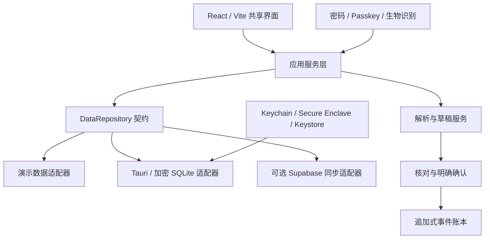

# Folio 技术设计

> 版本：1.1
> 状态：目标架构
> 更新日期：2026-07-29

## 1. 架构结论

Folio 采用“React 共享界面 + Tauri 2 原生壳 + 加密本地账本 + 可选云同步”的本地优先架构。



浏览器版只能使用 Web 能力；桌面和移动端通过 Tauri 命令访问数据库、钥匙串、生物识别和受限文件系统。React 组件不得直接依赖某个平台 API。

## 2. 代码边界

```text
src/
  app/                 页面状态和应用用例
  domain/              领域实体、金额、账本规则
  data/
    repository.js      数据仓库契约与工厂
    demo/              虚构演示数据
    local/             Tauri 本地适配器
    sync/              可选云同步适配器
  services/
    import/            CSV/TSV/XLSX/飞书主动粘贴/文件解析
    ai/                模型适配、结构化抽取
    auth/              登录、解锁和会话状态
  components/          与数据来源无关的 React 组件
src-tauri/
  src/                 Rust 命令、加密数据库、原生安全能力
```

`DataRepository` 是 UI 唯一允许使用的数据入口。M1 先以只读 `getSnapshot()` 完成页面解耦；本地账本进入 M2 后扩展为以下异步领域契约：

```ts
interface DataRepository {
  getDashboardSnapshot(): Promise<DashboardSnapshot>;
  listAccounts(query?: AccountQuery): Promise<Account[]>;
  listHoldings(query?: HoldingQuery): Promise<Holding[]>;
  listTransactions(query?: TransactionQuery): Promise<Transaction[]>;
  listReminders(query?: ReminderQuery): Promise<Reminder[]>;
  createDraft(input: DraftInput): Promise<DraftChange>;
  confirmDraft(draftId: string, confirmation: Confirmation): Promise<LedgerResult>;
  exportBackup(options: BackupOptions): Promise<ExportResult>;
}
```

仓库内的演示适配器只提供虚构数据。真实适配器通过运行时配置加载，页面代码不包含真实账户、金额、凭证或个人文件。

## 3. 数据模型

### 3.1 金额

- 数据库存储 `amount_minor BIGINT` 和 ISO 4217 `currency`。
- 展示层负责格式化，领域层不接收 `"¥12,800"` 之类的字符串金额。
- 汇率记录必须包含来源、报价时间和基准币种。

### 3.2 追加式账本

核心实体：

- `vault`：一个用户或家庭的加密数据空间。
- `institution`、`account`、`holding`、`holding_valuation`。
- `ledger_event`：不可变的账本事件。
- `event_link`：转账双边记录、冲销与修订关系。
- `draft_change`：尚未计入正式余额的结构化草稿。
- `import_batch`、`source_record`：导入来源、指纹和幂等状态。
- `reminder`、`reminder_occurrence`：事项定义与每次发生。
- `document`、`evidence`：原始文件元数据和字段证据。
- `audit_event`：安全和数据操作审计。

修改已确认记录时不做原地覆盖，而是追加冲销或修订事件。账户余额、净资产和现金流是账本事件的可重建投影；持仓表现来自账户内产品明细及不可变估值快照，不参与账户余额的二次求和。

### 3.3 状态机

```text
captured → parsed → needs_review → confirmed → reconciled
                     ↘ rejected
confirmed → reversed
```

只有 `confirmed` 和 `reconciled` 进入正式汇总。AI、OCR 和语音只能把记录推进到 `needs_review`。

### 3.4 账户生命周期

- `account_create_draft`、`account_update_draft` 和 `account_archive_draft` 只创建 `needs_review` 草稿，不直接修改账户或余额。
- `account_confirm_draft` 根据草稿动作在单个 `IMMEDIATE` 事务中创建、更新或归档账户，并追加不可变审计事件；重复确认返回同一结果。
- 账户资料更新保存核对时的 before/after 快照，确认时重新读取当前记录；若核对后发生并发变化则拒绝确认。
- 账户已有账本事件后币种不可直接修改；币种迁移必须通过新账户和双边转账完成。
- 归档草稿创建与确认两个阶段都要求账户余额为 0 且有效持仓数为 0；否则原生层拒绝。归档只设置 `archived_at`，不会删除账户、账本事件或审计历史。

### 3.5 持仓与估值生命周期

- `holding_create_draft` 接受账户、产品名称、产品类型、币种、数量、成本、市值、估值日期及可选脱敏标识/备注；账户必须有效，持仓币种必须与账户一致。
- 数量在领域层精确解析为 `units_micros`，最多 6 位小数；成本和市值精确解析为整数最小货币单位，拒绝指数写法、超精度与越界数值。
- 新增持仓和 `holding_valuation_create_draft` 都只创建 `needs_review` 草稿。`holding_confirm_draft` 在单个 `IMMEDIATE` 事务中创建持仓或追加估值，并写入审计事件；拒绝草稿不会产生正式记录。
- `holding_valuations` 禁止更新和删除。估值更新保存前一估值 ID，确认时再次校验当前版本；过期或并发草稿安全拒绝，不能静默覆盖新数据。
- 资产快照只取每个持仓的最新估值计算收益额和基点收益率，同时返回估值历史数量。`affectsAccountBalance` 固定为 `false`，因为持仓属于账户余额的内部拆分。
- 持仓新增和普通估值更新不写 `ledger_events`。`holding_operation_create_draft` / `holding_operation_confirm_draft` 支持申购、赎回、分红和费用：账户内部申购/赎回仅追加估值快照；外部结算以同币种双边转账写入；分红/费用分别追加收入/支出事件。
- `holding_operations` 保存操作类型、精确金额/数量变化、前后估值、结算账户、账本关联和说明，并禁止更新或删除。确认使用 `IMMEDIATE` 事务重新读取最新估值；过期草稿安全拒绝。
- 产品操作生成的账本元数据包含 `holdingOperationId`。普通流水冲销/修订入口检测到该关联后拒绝单边更正，防止余额投影与持仓历史分叉。
- `holding_operation_correction_create_draft` 读取原操作、前后估值及关联账本事件，生成反向操作计划；`holding_operation_correction_confirm_draft` 在单个 `IMMEDIATE` 事务中重新校验原操作未被冲销、关联事件未被改变，以及位置类操作的结果估值仍为最新版本。
- 确认冲销时，申购/赎回互为反向操作，分红/费用互为反向操作；账本侧为每个关联事件追加 `reversal`，位置侧追加恢复到原操作前数值的新估值。`holding_operation_corrections` 一对一连接原操作与补偿操作并禁止更新/删除。
- 产品操作快照返回 `reversedByOperationId`、`reversesOperationId`、`correctionReason`、`reversed` 和 `isReversal`。可移植导出在 `holding_operations.csv` 中保留同样的关系；加密备份恢复会连同关联表迁移保险库标识。
- 持仓、全部估值快照和产品操作进入 SQLCipher 加密备份；用户重新认证并明确确认后，可在可移植明文 ZIP 中导出 `holdings.csv`、`holding_valuations.csv` 与 `holding_operations.csv`。
- `holding_update_draft` 只允许修改名称、产品类型、脱敏尾号和备注；账户、币种及估值历史保持不变。确认时比较核对前后的完整资料快照，发现并发修改即拒绝。
- `holding_archive_draft` 保存当前产品资料、最新估值 ID、数量、成本、市值和估值日期；确认时同时复核资料与最新估值版本，再仅设置 `archived_at`。
- `vault_get_snapshot` 返回有效与已归档持仓及 `archivedAt`，界面默认只展示有效持仓；归档持仓仍可筛选查看，但不再进入有效数量和市值拆解。
- 账户快照返回 `activeHoldingCount`。账户归档的创建和确认事务都会重新计数，有效持仓未清零时安全拒绝，避免产生挂在已归档账户下的有效产品。

### 3.6 手动流水生命周期

- `transaction_create_draft` 只接受收入、支出和转账三类结构化输入；金额在 Rust 领域层精确解析为正整数最小货币单位，拒绝零值、负值、指数写法、超精度和越界数值。
- `transaction_confirm_draft` 要求明确用户确认，并在单个 `IMMEDIATE` 事务中追加账本事件与审计记录；同一草稿重复确认返回既有结果，不会重复影响余额。
- 收入和支出各生成一笔带方向的不可变事件。账户间转账生成共享 `link_id` 的 `transfer_out` 与 `transfer_in` 两笔事件，金额相等、方向相反，并原子写入。
- 当前正式转账只允许两个不同的有效同币种账户。跨币种转账默认拒绝，等待汇率、费用、舍入与证据核对流程完成后再开放。
- `vault_get_snapshot` 将一组双边转账事件投影为一笔逻辑交易；现金流汇总排除转账，账户余额仍由全部已确认账本事件重建。
- `transaction_correction_create_draft` 只接受尚未冲销的正式收入、支出或完整双边转账，并保存原始交易快照、修正类型和必填原因；取消或返回修改会拒绝旧草稿。
- 冲销确认在单个 `IMMEDIATE` 事务中为原始单边或双边事件分别追加等额反向事件，并通过 `reverses_event_id` 保留精确追溯关系；原记录不删除，只标记为已冲销并从有效汇总中排除。
- 修订确认在同一个 `IMMEDIATE` 事务中先追加原交易的反向事件，再写入更正后的单边或双边交易。任一步失败都会整体回滚，不会出现“已冲销但未写入替代流水”的中间状态。
- 修正确认支持幂等重试，并在确认时重新读取原交易、账户状态和既有反向事件；已冲销交易、已归档账户或并发变化均安全拒绝，防止重复影响余额。
- `vault_get_snapshot` 保留已冲销原记录及修正原因，并将替代交易标记为修订后记录；余额、收入、支出和净现金流只计算仍然有效的正式流水。
- 拒绝或取消的流水与修正草稿不会写入 `ledger_events`；任何正式流水后续修正都禁止原地改写。

### 3.7 财务事项生命周期

- `reminder_create_draft`、`reminder_update_draft`、`reminder_complete_draft` 和 `reminder_archive_draft` 只创建 `needs_review` 草稿，不直接改变正式事项。
- `reminder_confirm_draft` 在单个 `IMMEDIATE` 事务中更新事项投影，同时追加 `reminder_events` 与不可变 `audit_events`；重复确认返回既有结果。
- 编辑、完成或归档草稿保存核对时的 before/after 快照；确认时重新读取当前事项，若核对后发生变化则拒绝覆盖。
- 金额为可选整数最小货币单位；关联账户存在时继承账户币种，否则使用保险库基础币种。日期、提前提醒天数和重复规则均由 Rust 领域层再次校验。
- 完成事项只切换状态并保留在“已完成”筛选中。归档设置 `archived_at` 并从当前快照移除，不物理删除事项、历史事件或审计记录。
- 事项是提醒页主对象；提醒时间附着于事项。生成或发送租金沟通文案不属于事项 CRUD，也不会由主操作触发。
- 一次性事项完成后进入 `completed`；月度/年度事项完成时追加不可变 `reminder_occurrences`，保留本期到期日、完成时间、下一期日期与确认草稿，再把事项推进到下一期并保持 `active`。
- 重复日期保存原始月/日锚点：1 月 31 日可暂落到 2 月末，下一期仍回到 3 月 31 日；2 月 29 日按年度推进时在非闰年落到 2 月末。

### 3.8 本机系统通知

- `notification_preferences` 与 `notification_schedules` 位于 SQLCipher 保险库内；后者只是可重建的系统排程投影，不是事项事实来源。
- `notification_enable` / `notification_disable` 必须携带用户明确确认并写入安全审计；`notification_status` 不触发系统授权弹窗。
- 默认 `generic` 模式固定使用“Folio 财务提醒 / 有一项财务事项需要处理”，不含标题、账户、金额、币种或备注。用户可明确改为 `title`，正文仍不含财务字段。
- 原生层使用 Apple `UserNotifications`。每个请求标识由事项 ID、计划日期、事项版本和时间经 SHA-256 生成，不含可读业务信息。
- 解锁和事项确认后执行幂等 reconcile：取消过期标识、以稳定标识替换变化项、最多保留未来 50 项。权限被拒绝或撤销时清空系统排程和派生表，但不改变事项。
- 调度失败不得回滚已经确认的事项；下次解锁自动重试。周期事项确认完成后已在同一事务中生成不可变 occurrence 并推进日期，随后通知核对会取消旧排程并安排下一期。

## 4. 本地存储和加密

### 4.1 数据库

- 桌面和移动端使用 SQLite。
- 正式数据采用 SQLCipher 或由 Rust 层提供的等价整库加密；普通 SQLite 文件不算完成。
- 数据库启用 WAL 时，WAL、SHM、临时文件和备份必须处于同等保护范围。
- 数据库迁移有版本号、事务和回滚前备份。

### 4.2 密钥层级

1. 创建保险库时生成随机 256 位数据加密密钥 `DEK`。
2. `DEK` 不写入 Git、环境变量、日志或普通配置文件。
3. 设备包装密钥由 macOS Keychain / Secure Enclave、iOS Keychain、Android Keystore 或 Tauri Stronghold 保护。
4. 用户选择应用密码恢复时，以 Argon2id 派生的密钥包装 `DEK`；数据库内只保存盐、参数和密文。
5. 生物识别只授权系统安全存储释放包装密钥；应用不接触指纹或面容模板。

恢复密钥是高风险能力：正式启用前必须实现重新认证、一次性展示、离线保管提示和轮换。

### 4.3 加密备份与恢复

备份使用与应用密码、设备 Keychain 分离的独立密码：

```text
当前应用密码重新认证
→ SQLite Online Backup 生成一致性 SQLCipher 快照
→ 随机 256 位备份数据库密钥
→ 清单 + 数据库密钥 + SQLCipher 文件
→ Argon2id（64 MiB / 3 次）派生备份密钥
→ XChaCha20-Poly1305 认证加密整个容器
→ 0600 临时文件 + 原子重命名保存
```

- 外层只暴露固定魔数、版本和 KDF 参数；保险库名称、币种、数量、SQLCipher 数据库与备份数据库密钥均在认证密文内。
- 单个备份容器上限为 128 MB，内部数据库上限为 96 MB；KDF 参数只接受当前固定安全配置，拒绝攻击者提供的异常资源参数。
- 导出通过原生文件对话框选择位置；前端不获得完整路径，也不拥有任意文件系统写权限。
- `.folio-backup` 被 Git 忽略；备份正文、应用密码、备份密码和数据库密钥不写入日志。

恢复分为“选择、检查、明确确认”：

1. 原生命令保存不透明选择令牌和 SHA-256 文件指纹，前端只看到文件名、大小和短指纹。
2. 备份密码解密后，在应用私有目录写入短期的、仍由 SQLCipher 加密的验证副本。
3. 在任何正式安装前检查容器认证标签、正文哈希、SQLCipher 完整性、保险库身份、数据计数和外键关系。
4. 用户指定新的保险库标识、名称和应用密码；恢复只允许创建新保险库，目标存在时安全拒绝。
5. 恢复数据库重写为新保险库身份，追加恢复审计，轮换新的随机 `DEK`，重新启用不可变账本触发器，再安装原生 session handle。
6. 任一步失败都会清理临时/目标文件；现有保险库不被覆盖或删除。Touch ID 默认关闭，恢复后需要重新登记。

## 5. 身份认证与应用锁

身份会话、应用解锁和数据解密是独立状态：

- Web：Supabase Auth 密码登录；通行密钥作为渐进增强。通行密钥能力上线前需锁定 SDK 版本并通过浏览器兼容测试。
- macOS/iOS：使用系统 LocalAuthentication；解锁成功后由钥匙串释放本地保险库包装密钥。
- Android：使用 BiometricPrompt 与 Android Keystore。
- 无生物识别设备或多次失败时，使用应用密码解锁。
- `vault_enable_biometric` 与 `vault_disable_biometric` 只允许当前已解锁保险库调用，均要求当前应用密码和 `confirmedByUser`。错误密码、锁定状态或未确认请求不得读写 Keychain。
- 启用时先由密码包装层解封 DEK，再写入受当前指纹集合保护的 Data Protection Keychain 条目；元数据落盘失败必须清理刚写入的条目。
- 关闭时先认证密码并原子更新保险库元数据，再删除本设备 Keychain 条目。应用密码包装的 DEK 和 SQLCipher 数据库保持不变。
- `vault_change_password` 只允许当前已解锁保险库调用，要求当前密码、新密码和 `confirmedByUser`。原生层先用当前密码解封 DEK，再用全新 Argon2id 盐、KEK 和 XChaCha20-Poly1305 nonce 重新封装同一 DEK；不执行 SQLCipher rekey，不触碰账本内容。
- 新密码元数据以私有权限原子替换；安全审计写入失败时恢复旧元数据。成功后旧密码立即失效，现有会话和受 Keychain 保护的同一 DEK 继续有效。
- React 只接收 `{ available, enabled }` 状态，不接收 DEK、生物识别模板或 Keychain 查询结果。
- 后台超过可配置时长、系统锁屏、注销或检测到密钥失效后，清空内存中的解密材料并重新锁定。

Web 端无法提供与原生 Keychain 完全相同的本地保证。Web 本地缓存仅保存最小必要、加密后的数据，并允许用户关闭离线缓存。

Web 启动使用失败关闭的数据模式状态机：

```text
未配置 / locked → LockedWebGate（不加载财务组件）
local（普通浏览器）→ LockedWebGate（拒绝模拟原生保险库）
demo + 显式开关 → PublicDemoGate → 用户确认 → 虚构数据界面 + 持久横幅
sync → WebIdentityGate → 身份成功 → 私人同步界面
```

`sync` 会话由 `WebSessionGuard` 监听指针、键盘、触摸和窗口聚焦活动；15 分钟无活动时先把 React 身份状态切换为 `signed_out`，立即卸载私人界面，然后执行尽力而为的 Supabase 注销。远端注销失败不能让本地 UI 重新进入已认证状态。

## 6. 可选云同步

云同步不是本地使用的前置条件。

- Supabase Auth 管理用户身份。
- Postgres 所有用户数据表启用 RLS，策略以 `auth.uid()` 和 `vault_membership` 限制行访问。
- 浏览器只使用 publishable/anon key；`service_role` 和 secret key 仅存在于受控服务端。
- 原始文件使用私有 Storage bucket 和短期签名 URL。
- 高敏感备注、附件正文和可识别账户信息在客户端加密后再上传。
- 同步单位为带事件种类、设备 ID、逻辑时钟、幂等键和哈希的不可变密文领域事件；M3 协议覆盖 `account_snapshot`、`holding_snapshot`、`holding_valuation`、`ledger_event`、`holding_operation`、`holding_operation_correction` 和 `reminder_snapshot`，提醒快照同时包含重复锚点与不可变 occurrence 历史。
- 持仓资料作为可变快照维护设备版本；估值、产品操作和补偿更正作为不可变事件按标识与完整内容幂等。远端恢复确认过的估值/操作时，会在 SQLCipher 内重建最小 `confirmed` 草稿凭据并标记 `sync_remote`，保持领域外键和“原设备已核对”证据，不重新触发资金动作。
- 冲突不覆盖已确认事件；产生待核对冲突记录。读取详情时原生层从不可变 inbox 重建 envelope，再次验证事件哈希、AAD 与 XChaCha20-Poly1305 认证标签，成功后才返回必要的领域 payload。

RLS 必须有跨用户否定测试：用户 A 无法读取、更新、删除用户 B 的任何数据，即使手工构造请求。

M3 云端 schema 使用以下安全分层：

```text
Supabase Auth user
→ vault_membership
→ user-owned device + public key
→ device-specific wrapped vault sync key
→ append-only encrypted domain event / conflict resolution
```

- `public` 暴露表全部启用并强制 RLS；`anon` 不获得任何 Folio 表权限。
- `encrypted_sync_events` 只向 `authenticated` 授予 `SELECT, INSERT`，不允许客户端更新或删除。
- 事件 AAD v2 绑定 vault、device、event、event kind、逻辑时钟、幂等键、时间和前序哈希；正文使用随机 24 字节 nonce 的 XChaCha20-Poly1305。
- 事件哈希覆盖 AAD、nonce 与密文；重复幂等键只有在 event ID 与哈希均一致时才视为安全重试，否则进入核对。
- Tauri 原生层为每台设备生成 X25519 密钥对；使用 HKDF-SHA256 从设备共享秘密派生 XChaCha 包装密钥。设备私钥、保险库同步密钥和待投递密文只存于 SQLCipher，React 只收到公钥、已包装密钥和密文 envelope。
- 本地 `sync_outbox_events` 和 `sync_inbox_events` 在生成/接收后不可更新或删除；可变投递/应用状态单独保存。入站先验哈希、AAD 和认证密文，再按账户 → 持仓 → 估值 → 账本 → 产品操作 → 补偿更正 → 提醒的依赖顺序落库；同类事件再按设备逻辑时钟稳定排序。
- 账户、持仓资料或提醒的跨设备内容分歧，以及不可变估值/操作的标识碰撞和任何缺失依赖，均进入 `sync_inbox_conflicts`，不会以 last-write-wins 静默覆盖。整页应用使用单个事务，冲突事件不创建草稿或业务半成品；关闭同步只停止新事件准备，不删除本地账本或历史密文。
- schema migration 15 增加 `sync_inbox_conflict_resolutions`。冲突证据与解决记录分别追加且禁止更新/删除；当前唯一解决动作是 `keep_local`。确认后只把对应 inbox 应用状态设为 `rejected / kept_local_by_user` 并追加 `conflict_resolved` 审计，不改写本机业务记录，也不删除远端密文。
- `sync_conflicts_list`、`sync_conflict_inspect` 和 `sync_conflict_keep_local` 是显式 Tauri 命令。列表可显示未处理项或历史；检查命令不返回同步密钥、nonce 或 ciphertext；保留本机命令要求独立的 `confirmedByUser=true`。发送侧 `needs_reconciliation` 当前只读展示，由产生该冲突的设备处理。
- “接受远端”暂不开放。未来只能把经过认证解密的 payload 映射为账户、持仓、账本或事项的原生 `needs_review` 草稿，并复用领域并发检查和明确确认，不能直接应用 inbox 内容。
- 入站成功会写 `incoming_applied` 审计。outbox 收集器据此跳过刚由同步恢复的可变快照和不可变事件，避免第二设备把相同密文领域事实回传形成同步回声；只有该设备随后产生的新领域确认审计才生成新版本。
- 加密备份恢复为新保险库时主动删除旧设备/云保险库绑定与 outbox，防止恢复副本克隆设备 ID 或重复使用同步身份。
- macOS 原生工作区把同步作为安全设置中的可选控制台，而不是应用启动前置条件。控制器复用非持久 Supabase Auth 客户端，以当前会话 `user.id` 绑定本机保险库；UI 必须分别确认启用和停用，展示待上传/冲突计数，并明确“停用不删除云端既有密文”。
- 设备状态读取必须先有内存身份会话，并由本机已绑定的 `cloudVaultId` 限定查询；前端只接收 `id/platform/createdAt/lastSeenAt/revokedAt`。当前不提供撤销写入口，直至近期重新认证、密钥轮换和其余设备 rewrap 能原子完成。
- `EncryptedSyncCoordinator.enable` 把远端 bootstrap 视为启用事务的第二阶段；若 RPC 或网络失败，立即调用本机 `sync_disable` 补偿回滚。远端 bootstrap 本身幂等，因此响应丢失后的再次启用不会创建第二个 vault/device。
- Tauri 生产与开发 CSP 的 `connect-src` 只在本机 IPC/开发服务器之外放行 `https://*.supabase.co` 和 `wss://*.supabase.co`；不开放通配协议或任意网络来源。Folio 专属项目域名确定后应在发布配置中进一步收紧为单一 host。
- 浏览器 Auth 使用 `persistSession: false`，不把长期刷新令牌放进 Web Storage；刷新页面需要重新登录。
- 浏览器默认数据模式为 `locked`；公开 `demo` 还必须有 `VITE_PUBLIC_DEMO_ENABLED=true`，`local` 在非 Tauri 环境安全拒绝。
- 通行密钥要求 `VITE_PASSKEY_AUTH_ENABLED=true`、安全来源与 WebAuthn 支持，生产环境还必须锁定 RP ID 和 HTTPS origins。
- 附件对象路径使用 `<auth.uid>/<vault_id>/<opaque_object_id>`，bucket 为私有；文件正文与元数据均应先在客户端加密。

## 7. 导入流水线

```text
选择文件，或主动粘贴带表头的表格单元格
→ 在原生进程内存中读取并计算 SHA-256
→ 解析为 SourceRecord
→ 字段映射与规范化
→ 拆分有效行与逐行错误
→ 生成 needs_review DraftChange 与对账报告
→ 用户明确确认
→ 单事务复核并写入 ledger_event / import_batch / audit_event
→ 释放原文件正文
```

- M2 接受 UTF-8 CSV/TSV 和真实 `.xlsx`；XLSX 仅读取第一个工作表，不执行宏、公式计算或外部链接。
- 飞书 Sheet/Base、Excel 和 Numbers 的复制单元格通常为 TSV；前端只在用户主动粘贴后编码原始字节，不调用 Clipboard API，也不申请后台剪贴板读取权限。
- 原文件限制为 10 MB、5,000 个数据行、64 列和每格 1,000 个字符；越界文件在产生草稿前拒绝。
- 日期和金额在 Rust 中重新解析；金额直接转换为整数最小货币单位，拒绝零值、指数写法、超精度和越界值。
- `source_hash + parser_version + row/external_record_id` 构成导入幂等依据；相同正文即使改名也不会重复增加余额。
- 同一文件内重复外部流水号、错误日期、错误金额、类型或币种不一致按行报告；有效行仍可单独核对。
- `transaction_import_confirm_draft` 在单个 `IMMEDIATE` 事务中重新检查草稿、账户状态、币种、余额安全和幂等键；任一正式写入失败则整体回滚。
- 生成审核草稿后，前端立即释放文件 base64 与粘贴原文；取消、返回修改或关闭弹窗会拒绝未确认草稿。原始正文不写入数据库、仓库或日志。
- CSV/TSV/XLSX 解析完全在本地完成；除非用户未来通过独立授权流程明确允许，不把文件正文发送给云模型。
- 飞书第一阶段已支持无 OAuth 的主动复制粘贴导入；后续只读连接器、增量游标及双向同步仍需另行定义授权、字段所有权和冲突策略。

## 8. AI 边界

- 所有模型通过 `ModelProvider` 接口调用，支持云模型和本地模型。
- M4 第一阶段使用版本化 `local_rules_v1` / `zh-finance-rules-3`，在前端本地把中文文字转成账户、流水、事项、规划或产品操作提案；设置和未建模动作直接拒绝，不降级为其他事件。
- 产品操作解析只匹配唯一有效持仓。申购/赎回要求原话逐项包含操作金额、结果份额、结果成本和结果市值；分红/费用要求金额与同币种结算账户。证据范围随提案保存，缺项、多个持仓、复合操作或方向不一致时不产生 `draftRequest`。
- `local_ledger_qa_v2` 以当前解锁快照执行确定性只读查询，回答余额、收支、近期流水、事项、月度环比、支出分类、最大金额支出和基础币种现金流解释；每个事实附 `account_balance`、`ledger_event` 或 `reminder` 引用 ID、数据时间和计算时间。
- 跨期聚合只使用未冲销、已确认、基础币种事件；转账不伪装成收支，其他币种不在缺少汇率时强行折算。“大额”只表示按金额排序，不能自动声称异常。聚合返回完整来源数与可见引用数，避免有限引用被误解为全部输入。
- `ModelProvider` 注册表显式声明 `dataBoundary` 与能力集合；当前 `folio_local_v1` 只有 `extract_proposal` 和 `answer_ledger`。外部提供器的每次调用若没有 `allowExternal: true` 会在执行前拒绝，不能把本地失败静默降级为云调用。
- macOS/iOS 原生端通过 `speech_transcribe_once` 调用 AVAudioEngine + Speech：命令先验证保险库已解锁和本次明确同意，录音限制为 3–30 秒，同一时刻只允许一个任务。
- Apple 请求固定 `requiresOnDeviceRecognition = true`，并先验证 `supportsOnDeviceRecognition`；离线模型不可用时安全失败，不降级联网。音频只进入内存缓冲，不落文件、不返回路径，命令只返回最长 4,000 字的文字。
- Web Speech API 仅作为 Web 环境的独立回退；如果系统服务可能联网，界面必须明确提示并逐次同意。用户始终可改用文字输入或系统听写。
- 服务端密钥不进入 Vite 环境变量，因为 `VITE_*` 会暴露给前端。
- 桌面个人密钥存入系统钥匙串；团队网关密钥只在服务端。
- 结构化抽取使用 JSON Schema，并保存输入哈希、模型版本、提示版本、证据位置和用户修订。
- 遥测不记录原始财务文本；调试明文日志必须显式开启且有自动过期。
- 模型输出没有账本写权限，只能创建草稿。

M4 的当前写入链如下：

```text
语音、直接文字、截图/PDF，或 Markdown/纯文本
→ local_rules_v1 生成字段、证据、置信度和未决项
→ React 提案核对（不能写账本）
→ 原生领域命令重新校验并创建 needs_review 草稿
→ SQLCipher 记录不可变 ai_proposal 证据
→ 原生最终核对页
→ 用户明确确认
→ 单事务领域写入 + 审计
```

- `ai_proposals` 与 `draft_changes` 一对一关联，原文、SHA-256、提供器、解析器版本、置信度和证据保存在 SQLCipher 中并禁止更新/删除。
- `ai_proposal_record` 只接受账户、产品操作、流水、事项和规划五类匹配的待核对草稿；产品操作必须关联 `manual_holding_operation` 草稿，重复调用按领域草稿幂等返回。
- `planning_profiles` 每个保险库最多一份，现金安全垫以整数最小货币单位保存，六类目标以基点保存且必须精确合计 10,000。
- 规划确认使用 `IMMEDIATE` 事务重新比较草稿中的完整前置版本；写入档案、追加不可变 `planning_events`、确认草稿和审计要么全部成功，要么全部回滚。
- 模拟沙盘没有 repository/原生命令句柄，只在 React 页面状态中计算“稳健 ↔ 权益”试算，离开工作区或锁定即清除。
- AI 审计事件只记录提案 ID、类别、提供器和置信度，不记录原始口述正文。
- 当前口述原文不进入云同步事件；未来启用云模型或跨设备草稿前，必须单独定义最小披露、用户授权和加密策略。
- 本地问答问题、指标和回答只存在于 React 解锁页面状态，不写数据库、不进入同步，锁定卸载工作区时清除；问答服务不持有任何 repository 写接口。

### 8.1 移动端统一 AI 收件箱

移动端的语音、截图/文档、直接文字和未来邮箱消息共享同一 `CapturedItem` 入口：

```ts
type CapturedItem = {
  id: string;
  source: "voice" | "image" | "pdf" | "markdown" | "text" | "email";
  sourceHash: string;
  capturedAt: string;
  extractedText: string;
  evidence: EvidenceRef[];
  privacyBoundary: "device_only" | "authorized_mailbox";
};
```

- 捕获层只负责得到文字、来源指纹和证据，不持有正式账本写接口。
- 分类层可把一条输入拆成多个 `Proposal`；账户、持仓、流水、事项和规划分别进入原有领域草稿。
- 收件箱状态为 `captured → parsed → needs_review → confirmed | rejected | duplicate`。
- 重复判断不会自动删除证据；命中重复时显示已有记录并等待用户处理。
- 移动界面只保留一个主入口和一条简短安全提示，详细隐私说明放入对应权限页或渐进展开，避免阻塞日常录入。

### 8.2 Apple 设备内文档证据

```text
原生文件选择器
→ 已解锁状态复核
→ 10 MB / 类型魔数 / 页数限制
→ 内存读取并计算 SHA-256
→ PDFKit 提取可选中文本；无文字层 PDF 页面渲染为标准 RGBA 后交给 Vision OCR
→ 生成最多 4000 字、80 个证据块
→ 前端本地规则解析与字段范围映射
→ 原件缓冲释放
→ 草稿确认后只把加密文字证据与文件指纹写入 SQLCipher
```

- 支持 1–50 页可选中文本或扫描 PDF，PNG、JPEG、HEIC、TIFF 图片，以及 UTF-8 Markdown / 纯文本；扫描页逐页渲染为最长边 1800 像素的标准 RGBA 位图，单页识别结束即释放。
- PDF 证据保存页码与字符范围；图片证据另外保存 Vision 置信度和归一化边界框。文件名、SHA-256、格式、大小、页数与截断状态随 AI 提案加密保存。
- 响应明确返回 OCR 页数与未识别页数；部分页面失败时提案显示不完整警告，不能把其余页面解释为整份文件。
- 原件二进制、完整本地路径和临时明文文件不返回 React、不写 SQLCipher、不写日志、不进入同步。用户编辑提取文字后，来源会切换为普通文字，旧文件证据不会继续附着。
- 原生命令在打开文件选择器前和返回结果前都检查保险库仍处于解锁状态；文件选择/识别期间自动锁定暂停，结束后恢复正常闲置计时。
- 常规 Rust 测试不依赖图形服务；`npm run test:vision` 显式生成无文字层的栅格 PDF，并在非沙箱 Apple Vision 运行环境验证页码、置信度和坐标。

### 8.3 QQ 邮箱信用卡通知

```text
用户开启 IMAP 并提供专用授权码
→ 本机密钥存储保存受保护的授权码
→ 按用户允许的专用文件夹 / 发件人增量拉取
→ 规范化消息并计算去重键
→ 解析为零个或多个待核对流水
→ 用户确认
→ 原有 transaction 草稿与追加式账本
```

- 连接器不得接收 QQ 登录密码，不得执行 IMAP 写入/删除命令，也不得持有 `transaction_confirm_draft` 权限。
- 服务只取解析所需的消息标识、时间、发件人和正文片段；完整邮箱和附件默认不归档。
- 增量游标、令牌和允许规则存入加密本地配置；日志不记录主题、正文、卡号或访问令牌。
- 去重键至少组合邮件 Message-ID、正文规范化哈希、卡片尾号、金额、币种和交易时间。
- 邮箱解析器输出必须标明消费、退款、撤销、分期、预授权或账单汇总；无法确定时不创建可确认草稿。
- 断开连接会撤销本地会话、删除令牌和增量游标，但不会删除已确认账本事件。

### 8.4 数据可移植导出

```text
用户选择明文导出
→ 明确确认隐私风险
→ 原生层重新验证当前保险库密码
→ SQLCipher 完整性检查与一致快照查询
→ 生成 UTF-8 CSV + manifest.json
→ ZIP 内存容器与 SHA-256 指纹
→ 0600 临时文件写入、fsync、原子改名
→ 追加成功审计事件
```

- 数据包包含 `accounts.csv`、`ledger_events.csv`、`reminders.csv`、`planning.csv`、`imports.csv`、可选 `audit_events.csv` 和 `manifest.json`。
- 导出保留整数最小货币单位，同时提供精确两位十进制展示列；原始账本事件不折叠，便于独立重放和审计。
- 任何以 `= + - @` 开头的用户文本均加安全前缀，防止 Excel/Numbers 打开 CSV 时执行公式。
- 明文导出与加密备份使用不同入口、文案和扩展名；默认 `.folio-export.zip` 会被 Git 忽略。原生命令拒绝未确认请求、错误密码和覆盖已有文件。
- 导出成功的审计只保存文件指纹、大小、选项和计数，不保存目标路径；ZIP 明文仅写入用户选择的位置，不进入保险库、日志或云同步。

## 9. 打包与发布

- 共享 React/Vite 构建继续支持浏览器部署。
- Tauri 2 生成 macOS `.app` / `.dmg`，以及 iOS 和 Android 工程。
- `npm run macos:verify:dmg` 以只读方式挂载实际 DMG，验证根目录内容、Applications 入口、Bundle ID/版本/最低系统、目标架构、动态库路径、隐私声明、签名与音频权限，并拒绝任何数据库、备份、导出、CSV/XLSX 或环境文件进入应用包。Gatekeeper 状态如实区分 ad-hoc 内部包与已公证包；`FOLIO_REQUIRE_NOTARIZED=1` 可在正式分发时把公证提升为硬门。
- `npm run macos:mvp:doctor` 把自动发布门、本人自用手工验收和对外分发门分别建模；默认运行真实 DMG 烟测，也支持 `--json` 输出 CI 可读证据。手工项目只从被 Git 忽略的 `.folio-mvp-acceptance.json` 布尔记录读取，不保存真实文件路径、金额、账户或密码；缺失、错误或未明确为 `true` 一律按未通过。
- `npm run mobile:doctor` 在初始化前检查完整 Xcode、iPhoneOS/iPhoneSimulator SDK、CocoaPods、JDK、Android Platform/Platform Tools/Build Tools/Command-line Tools/NDK、SDK Manager、ADB，以及 3 个 iOS 和 4 个 Android Rust targets；`--json` 产出 CI 可读证据，`--strict` 用作发布门。
- macOS 正式分发需要 Apple Developer 身份、代码签名、公证和自动更新签名。
- iOS 需要完整 Xcode 和 Apple Developer 配置；Android 需要 JDK、Android Studio/SDK 和签名密钥。
- CI 只使用测试数据；签名证书和密钥放在 CI 密钥库，不写入仓库。
- 每个发布物记录版本、Git commit、数据库 schema、签名身份和 SBOM。

## 10. 测试策略

- 领域测试：金额精度、转账守恒、冲销、状态机。
- 仓库契约测试：演示、本地和同步适配器对同一测试套件通过。
- 导入测试：重复文件、错误单位、空行、不同日期格式和大额异常。
- 安全测试：密钥扫描、日志脱敏、锁定、RLS 跨用户、备份恢复。
- 端到端测试：创建保险库、导入、核对、锁屏、重启和恢复。
- 发布测试：macOS DMG 只读挂载烟测、签名/公证、干净安装与升级迁移；iOS/Android 在 MVP 后执行安装和升级迁移。

## 11. 关键技术决策记录

| 决策 | 选择 | 原因 |
|---|---|---|
| 原生壳 | Tauri 2 | 共享现有 React，支持桌面与移动，原生安全能力边界清晰 |
| 数据策略 | 本地优先 | 离线可用，降低真实财务数据暴露面 |
| 本地数据库 | 加密 SQLite | 查询、事务、迁移和备份能力适合账本 |
| 云端 | 可选 Supabase | Auth、Postgres、RLS、Storage 可组合，且不阻塞纯本地模式 |
| 账本 | 追加事件 | 可审计、可撤销、可重放和便于冲突处理 |
| AI 写入 | 草稿后确认 | 防止幻觉或识别错误直接污染资产 |
