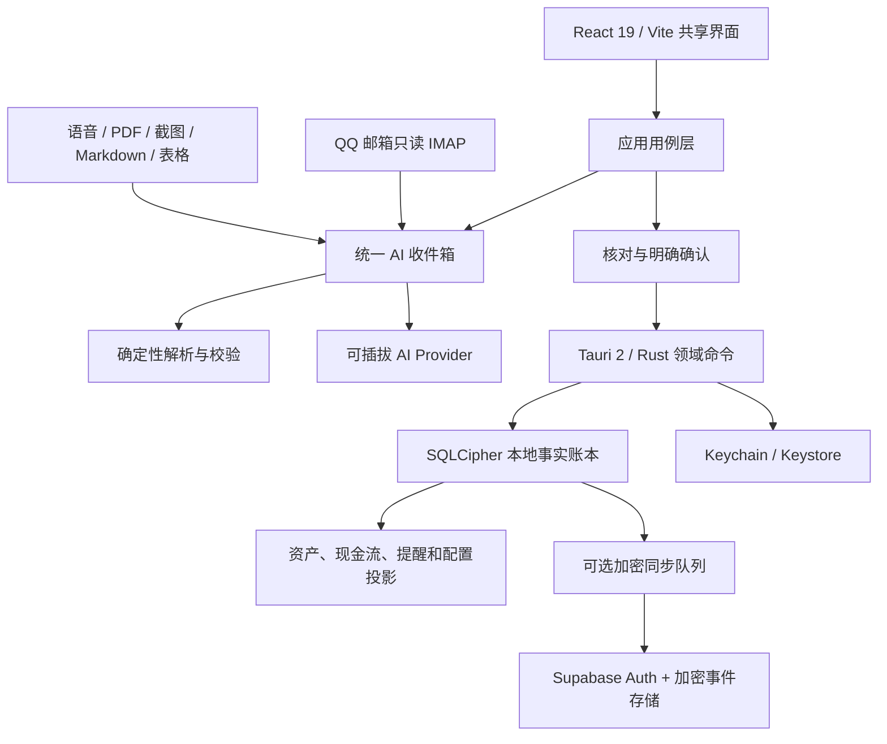

# Folio 正式开发 Brief 与技术蓝图（v0.1 归档）

> 文档版本：0.1  
> 状态：正式开发基线，后续持续更新  
> 更新日期：2026-07-30  
> 产品阶段：高保真 Demo → 可长期使用的移动优先、本地优先个人财务工具

---

## 0. 如何使用这份文档

这份文档用于统一产品范围、数据口径、技术架构、开发顺序和验收标准。后续每次调整方案时：

1. 先更新“决策记录”；
2. 再更新对应功能或技术章节；
3. 已进入开发的内容同步更新状态；
4. 涉及金额、同步或安全边界的改动必须补测试；
5. 不在本文范围内的新功能先进入“候选池”，不直接插入当前迭代。

状态约定：

- `已具备`：仓库已有实现和自动化测试；
- `部分具备`：已有基础能力，但尚未形成完整用户闭环；
- `待开发`：方案已明确，尚未实现；
- `后置`：不阻塞第一版正式可用。

---

## 1. 产品概述

### 1.1 一句话定义

Folio 是一个本地优先的个人财务驾驶舱：把分散在银行、信用卡、基金、保险、房产与租金中的信息统一整理，并通过语音、邮件、文件和手工输入生成可核对的财务记录。

### 1.2 核心问题

产品解决四类持续发生的问题：

1. **不知道钱在哪里**：资产分散，容易漏掉账户、持仓和闲置活期；
2. **不知道何时要处理**：租金、保险缴费、分红、理财到期和信用卡还款容易遗忘；
3. **维护成本太高**：手工表格需要频繁更新，移动端使用率低；
4. **输入不可信**：语音、OCR 和 AI 可能识别错金额，不能直接修改真实资产。

### 1.3 产品承诺

- 用户可以随时用自然语言、语音、截图、PDF、Markdown、表格或邮件补充信息；
- 每条候选记录都保留来源和证据；
- 金额变更一定经过“解析 → 核对 → 明确确认”；
- 账本能够解释每个汇总数字是如何得出的；
- 未确认、重复、缺字段或有冲突的数据不会进入正式资产；
- 本地仍可独立工作，云同步和外部 AI 不是基本使用前提。

### 1.4 第一版不承诺

- 不承诺直接控制银行账户或自动交易；
- 不承诺对所有银行 App 进行实时直连；
- 不把 AI 建议包装为确定性的投资结论；
- 不在没有来源和汇率的情况下强行合并外币资产；
- 不允许邮箱、语音或文件解析后自动入账；
- 不把投资组合模拟结果混入真实资产。

---

## 2. 产品原则

### 2.1 准确优先于自动化

自动化只能减少录入成本，不能降低确认标准。金额、币种、账户、方向和日期缺少任一关键字段时，记录进入“需补充”，不得猜测。

### 2.2 事实、建议与模拟严格分层

- **事实层**：账户、流水、持仓、估值、事项；
- **建议层**：AI 解释、风险提示、调仓建议；
- **模拟层**：投资沙盘和假设结果。

建议和模拟永远不能直接修改事实层。

### 2.3 本地优先

本机 SQLCipher 账本是默认事实源。没有网络、没有 Supabase、没有外部 AI 时，用户仍可解锁、查看、手工录入、设备内语音识别、导入资料、核对和备份。

### 2.4 所有正式变化可追溯

已经确认的流水和产品操作不原地覆盖。错误通过冲销、补偿和修订事件纠正，原记录继续保留。

### 2.5 最小数据暴露

能在设备内完成的提取尽量不上传。凭证、原始邮件、原始录音和完整财务文件默认不进入云端。

---

## 3. 目标用户与核心场景

### 3.1 核心用户

- 同时使用多家银行、信用卡、基金和理财产品；
- 有保险、租金或周期性财务事项；
- 愿意维护财务信息，但不愿每天打开复杂表格；
- 需要手机随手录入，并在 Mac 上集中核对、备份和整理。

### 3.2 高频场景

1. 收到信用卡消费邮件，自动形成待核对流水；
2. 说“今天招商信用卡在盒马花了 286.50 元”，形成支出草稿；
3. 说“卖出招行 A 基金，买入建行 B 基金”，拆成多条有关联的候选操作；
4. 上传保险 PDF，识别缴费日、分红日、保障期限和注意事项；
5. 上传截图或 Markdown 财务清单，批量建立账户、持仓、事项和历史流水；
6. 查看哪些活期资金已闲置超过阈值；
7. 查看未来 30 天租金、保险、到期、还款和定投事项；
8. 在独立沙盘中调整资产比例，不影响真实账本。

---

## 4. 产品功能清单

| 模块 | 主要能力 | 优先级 | 当前状态 |
|---|---|---:|---|
| 安全进入 | 应用密码、Touch ID/生物识别、自动锁定、密码回退 | P0 | 已具备，待真机验收 |
| 总览 | 净资产、活期可用、本月收支、近期事项、数据质量 | P0 | 部分具备 |
| 账户 | 银行、现金、投资、保险、房产、信用卡/负债账户 | P0 | 已具备 |
| 持仓 | 基金、理财、保险等账户内产品和估值历史 | P0 | 已具备 |
| 流水 | 收入、支出、转账、冲销、修订、大额筛选 | P0 | 已具备 |
| AI 收件箱 | 多来源候选记录、需补充、待核对、重复、隔离 | P0 | 待开发持久化多记录版本 |
| QQ 邮箱 | 只读抓取信用卡通知并生成待核对流水 | P0 | 待开发 |
| 多模态录入 | 语音、截图、PDF、Markdown、纯文本、CSV/XLSX | P0 | 单条链路已具备，批量链路待开发 |
| 财务事项 | 租金、保险、理财到期、还款、定投、闲置资金提醒 | P0 | 基础事项已具备 |
| 数据导入 | 手工、模板、飞书主动粘贴、批次映射和去重 | P0 | 部分具备 |
| 数据质量 | 未对账、缺失映射、过期估值、重复项、孤立事项 | P1 | 待开发 |
| 产品表现 | 收益、成本、估值走势和数据时效 | P1 | 部分具备 |
| 资产配置 | 按资产类别、账户和产品查看占比与目标偏差 | P1 | Demo 具备，真实口径待接入 |
| AI 调仓建议 | 基于目标、期限、流动性和市场证据生成建议 | P1 | 待开发 |
| 投资沙盘 | 独立模拟调整比例、现金流和风险，不写真实账本 | P1 | Demo 具备，真实引擎待开发 |
| 市场信息 | 经许可的数据源、来源时间、风险提示 | P2 | 后置 |
| 加密同步 | 多设备端到端加密事件同步与冲突隔离 | P1 | 协议已具备，真实环境待演练 |
| 备份恢复 | 独立密码加密备份、恢复为新保险库 | P0 | 已具备，待人工验收 |
| 可移植导出 | 用户重新认证后导出明文 CSV/ZIP | P1 | 已具备 |
| 桌宠提醒 | 猫猫的欢迎、处理、待核对和提醒状态 | P2 | 视觉方案已具备 |

---

## 5. 核心用户路径

### 5.1 首次使用

```text
创建本地保险库
→ 设置应用密码
→ 可选启用生物识别
→ 选择空白开始或导入资料
→ 解析成多条候选记录
→ 逐项核对账户、持仓、流水、事项
→ 显示最终写入清单
→ 明确确认
→ 生成首个总览和数据质量报告
```

### 5.2 日常语音录入

```text
按住语音按钮
→ 设备内转写
→ 按当前模块识别意图
→ 拆分为一条或多条候选记录
→ 显示金额、账户、方向、日期和证据
→ 用户修改或补充
→ 明确确认
→ 原生事务写入账本
```

### 5.3 信用卡邮件录入

```text
连接 QQ 邮箱专用文件夹
→ 增量读取新邮件头
→ 白名单命中后临时读取正文
→ 一封日报拆成多条候选消费
→ Message-ID/UID/业务指纹三级去重
→ 匹配唯一信用卡账户
→ 用户核对
→ 确认后写入支出事件
```

### 5.4 文件录入

```text
用户主动选择截图/PDF/Markdown/表格
→ 设备内识别文字与页码/坐标证据
→ 规则解析 + 可选外部多模态模型
→ 结构化候选记录
→ 金额和账户的领域校验
→ 用户确认
→ 写入正式账本并释放原文件缓冲
```

---

## 6. 顶层技术架构

### 6.1 架构结论

沿用现有项目的本地优先架构：



### 6.2 代码职责

- **React**：界面、录入状态、核对页面和只读展示；
- **JavaScript 领域层**：前置格式校验、模型适配和 Demo；
- **Rust 原生层**：凭证访问、文件读取、设备能力、最终金额校验和数据库事务；
- **SQLCipher**：本机唯一事实账本；
- **Supabase**：登录、设备登记和可选加密事件同步；
- **AI Provider**：只生成提案或回答，不持有直接写账能力。

### 6.3 关键边界

React 不直接执行 SQL，不接触数据库密钥、QQ 授权码或长期 AI 密钥。所有正式写入必须经过 Rust 领域命令重新校验。

---

## 7. 后端与存储方案

### 7.1 本地事实源

正式版优先使用当前已经落地的：

- SQLite + SQLCipher；
- `rusqlite` 的 bundled SQLCipher；
- WAL、SHM、临时文件和备份同等保护；
- 数据库版本迁移和迁移前备份；
- 不可变 `ledger_events`、估值、产品操作和审计事件；
- `IMMEDIATE` 事务完成确认，避免并发覆盖。

本地数据库保存：

- 账户、持仓、估值、账本事件；
- 产品操作与补偿更正；
- 提醒和发生历史；
- 导入批次、AI 提案、字段证据、去重指纹；
- 邮箱同步状态和最小邮件元数据；
- 可选加密同步队列和冲突。

### 7.2 凭证存储

下列内容不能进入 SQLite 普通字段、Git、前端状态或日志：

- QQ 邮箱授权码；
- AI Provider API Key；
- Supabase Secret/Service Role Key；
- 本地保险库 DEK；
- 设备私钥。

推荐位置：

| 凭证 | 开发环境 | 正式桌面/移动端 |
|---|---|---|
| QQ 邮箱授权码 | 本机临时测试 Keychain | Keychain/Keystore |
| 用户自带 AI Key | 环境变量仅用于开发 | Keychain/Keystore |
| 托管 AI Key | Supabase 本地 `.env` | Supabase Edge Function Secret |
| Supabase publishable key | `.env.local` | 可公开运行配置，依赖 RLS |
| Supabase secret key | 不进客户端 | 只在受控服务端 |

不建议正式 App 自动扫描用户所有环境变量。可在“开发者模式”中显式读取约定名称；普通用户使用可见的设置页导入 API Key，并保存到系统安全存储。

### 7.3 可选云同步

Supabase 不替代本地账本，而是保存：

- 已认证用户和设备；
- 端到端加密事件密文；
- 密钥封装 envelope；
- 最小路由元数据；
- 加密冲突和解决记录。

云端不得保存账户名、余额、金额、币种、备注、提醒标题和邮件正文的明文。第一套正式环境建议使用 Singapore 区域，并分离：

- `dev`：开发和自动测试；
- `staging`：脱敏/虚构数据验收；
- `prod`：真实用户。

### 7.4 原始文件与邮件

第一版默认不长期保存：

- 原始麦克风录音；
- 完整信用卡邮件正文；
- 用户上传的 PDF/截图/Markdown 原件；
- 完整本地文件路径。

长期保存的是：

- 文件或邮件哈希；
- 页码、文字区间、可选坐标；
- Message-ID/UID 的哈希或不透明标识；
- 解析字段、置信度、解析器版本；
- 用户确认后的领域记录。

---

## 8. QQ 邮箱信用卡流水方案

### 8.1 接入方式

个人 QQ 邮箱第一版使用标准 IMAP，只读访问用户指定文件夹：

- 用户在 QQ 邮箱开启 IMAP 服务并生成第三方客户端授权码；
- 连接 `imap.qq.com:993`，强制 TLS 和证书校验；
- 不收集 QQ 网页登录密码；
- 不实现 SMTP，不发送邮件；
- 不删除、不移动、不标记已读；
- 默认只读取用户创建的 `Folio信用卡` 文件夹。

正式使用前应做一个小型技术验证，锁定 Rust IMAP/MIME 库及其 TLS 依赖，不在方案阶段绑定尚未验证的库版本。

### 8.2 用户配置

设置页需要：

1. QQ 邮箱地址；
2. 授权码；
3. 文件夹名称；
4. 银行发件人白名单；
5. 标题关键词；
6. 信用卡尾号与 Folio 负债账户映射；
7. 手动“测试连接”和“立即检查”；
8. 断开连接与删除本机凭证。

### 8.3 增量同步

每个邮箱连接在 SQLCipher 内保存：

- 连接 ID 和邮箱地址哈希；
- 文件夹；
- `UIDVALIDITY`；
- 最后成功处理的 UID；
- 最后检查时间；
- 过滤规则版本；
- 最近错误码；
- 是否暂停。

同步顺序：

1. 连接后核对服务器证书；
2. 打开指定文件夹；
3. 检查 `UIDVALIDITY` 是否变化；
4. 只读取新增 UID 的邮件头；
5. 命中发件人和标题白名单后再读取正文；
6. 解析后立即释放完整正文；
7. 写入收件箱候选项和最小来源证据；
8. 成功后推进游标。

MVP 只保证 App 已解锁且正在运行时检查。完全退出后的后台定时抓取需要额外评估 macOS Helper、iOS BackgroundTasks 和 Android WorkManager，不阻塞第一版。

### 8.4 邮件解析器

采用“银行模板优先、AI 补充”的策略：

```text
MIME 解码
→ 去除追踪像素/脚本/样式
→ 银行模板识别
→ 确定性字段提取
→ 多条消费拆分
→ AI 仅处理未覆盖字段
→ Rust 金额与账户校验
→ 待核对
```

每个银行适配器必须输出统一字段：

- 通知类型：消费、退款、撤销、手续费、账单、还款；
- 卡尾号；
- 交易时间和原始时区；
- 金额字符串；
- 币种；
- 商户；
- 可选类别；
- 字段证据；
- 解析器名称和版本；
- 置信度和缺失字段。

### 8.5 去重

使用三层幂等键：

1. `邮箱连接 + 文件夹 + UIDVALIDITY + UID`；
2. `邮箱连接 + Message-ID`；
3. `卡尾号 + 通知类型 + 交易时间 + 币种 + 金额 + 商户标准化哈希`。

同一日报内的每条消费必须有自己的 `source_record`。更换解析器版本允许重新解析，但不能产生第二次经济影响。

### 8.6 安全失败条件

出现以下情况时停止自动生成正常草稿，进入隔离：

- 授权码失效；
- TLS/证书错误；
- `UIDVALIDITY` 意外变化；
- 文件夹不存在；
- 发件人或标题规则未命中；
- 卡尾号无法唯一匹配账户；
- 金额或币种不完整；
- 退款/撤销无法匹配原消费；
- 同一业务指纹已确认；
- 邮件格式大幅变化。

---

## 9. 多模态 AI 接入方案

### 9.1 统一 AI 收件箱

语音、文字、邮件、截图、PDF、Markdown、CSV/XLSX 和未来的飞书/API 都进入同一个收件箱状态机：

```text
captured
→ parsing
→ needs_review / needs_more_info / duplicate / quarantined
→ confirmed / rejected
```

每个收件箱项目包含：

- `source_type`；
- `source_record_id`；
- 原始来源指纹；
- 一个或多个结构化提案；
- 每个字段的证据；
- 缺失字段；
- 置信度；
- 解析器/模型版本；
- 去重结果；
- 目标领域草稿 ID；
- 用户最终处理结果。

### 9.2 语音

Apple 平台 MVP：

- 每次录音单独授权；
- 强制设备内语音识别；
- 当前语言没有离线识别器时直接失败，不静默上传音频；
- 原始录音不落盘；
- 转写文本进入同样的结构化解析和核对流程。

针对金额精度：

- 同时保留原始转写片段和标准化金额；
- “一万二”“1.2 万”“12000”最终统一为十进制字符串；
- 识别到多个金额时不得自行选择；
- “从 A 转到 B”必须唯一匹配两个不同账户；
- 缺失币种时只可继承已唯一匹配账户的币种；
- 用户确认页同时显示原话证据和标准值。

### 9.3 截图和 PDF

Apple 设备优先使用 PDFKit/Vision 在本机提取：

- 可选文本 PDF：提取文字并保留页码/区间；
- 扫描 PDF/截图：OCR 并保留坐标和置信度；
- 原件只在原生内存缓冲中短暂存在；
- 设备内提取后再决定是否需要外部模型。

外部多模态模型只在用户明确同意本次发送时使用。默认发送必要页面或经过裁切/脱敏的证据，不发送整份保险或财务档案。

### 9.4 Markdown 和表格

- Markdown/纯文本优先在本地按结构化标题和表格解析；
- CSV/TSV/XLSX 使用确定性表格解析器；
- 飞书、Excel 和 Numbers 支持用户主动粘贴 TSV；
- 创建草稿后释放原始粘贴文本；
- 大文件采用批次和分页，不把整表一次塞给模型；
- 第一版全量冷启动格式使用显式 `folio_import_version`。

### 9.5 外部 AI Provider

保留当前 `ModelProvider` 适配层，并支持两种正式模式：

#### BYOK

- 用户在设置页填入自己的 API Key；
- Key 保存在 Keychain/Keystore；
- 原生层直接请求供应商；
- 每次调用显示供应商、发送内容类型和隐私提示；
- 适合个人自用和开发阶段。

#### 托管模式

- 客户端携带登录态调用受保护的 Supabase Edge Function；
- Provider Secret 只保存在服务端 Secret；
- 服务端完成鉴权、配额、速率限制和脱敏日志；
- 不把服务端密钥打包进客户端。

如果采用 OpenAI：

- 新能力以 Responses API 为主；
- 图片和 PDF 使用 `input_image`/`input_file`；
- 结构化提取使用 Structured Outputs；
- 默认 `store: false`；
- 只把模型输出当作候选数据；
- API 数据保留策略需在隐私说明中明确，不能把 `store: false` 描述为“绝对零保留”。

### 9.6 结构化输出

模型输出必须符合版本化 JSON Schema，例如：

```json
{
  "schema_version": "folio.finance_proposal.v1",
  "items": [
    {
      "kind": "expense",
      "account_ref": "card_tail_1234",
      "amount_decimal": "286.50",
      "currency": "CNY",
      "occurred_at": "2026-07-30T12:35:00+08:00",
      "merchant": "盒马",
      "evidence": [],
      "missing_fields": [],
      "confidence_bps": 9700
    }
  ]
}
```

模型不得直接输出最终 `ledger_event`，也不得生成数据库 ID、幂等键或确认状态。这些由应用领域层生成。

---

## 10. 数据库扩展建议

现有 `import_batches`、`draft_changes`、`ai_proposals` 和不可变账本继续保留。正式收件箱建议新增或升级为：

### 10.1 `ingestion_sources`

保存来源配置的非敏感部分：

- 类型：voice、file、email、manual、sheet；
- Provider；
- 显示名称；
- 配置版本；
- 启用/暂停状态；
- 凭证引用，不保存凭证本体。

### 10.2 `ingestion_batches`

一封日报、一份文件或一次语音为一个批次：

- 来源；
- 解析器版本；
- 源指纹；
- 项目总数；
- 有效/需补充/重复/隔离数量；
- 批次状态；
- 创建和确认时间。

### 10.3 `source_records`

每一条来源事实一行：

- 批次 ID；
- 外部记录不透明标识；
- 业务指纹；
- 来源类型；
- 证据 JSON；
- 原始字段哈希；
- 解析状态；
- 关联收件箱项目。

### 10.4 `inbox_items`

- 提案类型；
- 结构化 payload；
- 缺失字段；
- 置信度；
- 去重状态；
- 目标领域草稿；
- 用户处理状态；
- 不可变处理历史。

### 10.5 `mailbox_sync_state`

- 邮箱连接 ID；
- 文件夹；
- `UIDVALIDITY`；
- 最后 UID；
- 最后成功时间；
- 最近错误；
- 过滤器版本。

QQ 授权码仍只存在 Keychain/Keystore。

---

## 11. 金额、汇总与防重防漏规则

### 11.1 金额表示

- 所有金额用最小货币单位整数保存；
- API、AI 和表单之间用十进制字符串传输；
- 禁止用 JavaScript 浮点数执行正式金额计算；
- 币种使用 ISO 4217；
- 数量单独使用固定精度整数，例如 `units_micros`；
- 超精度、指数写法和越界值直接拒绝。

### 11.2 账户符号

- 资产账户余额为正；
- 信用卡和其他负债账户欠款为负；
- 信用卡消费写入负向支出事件，使欠款绝对值增加；
- 信用卡还款是银行账户到负债账户的双边转账；
- 还款不重复计入支出；
- 新建负债账户时 UI 必须明确展示并校验符号。

### 11.3 核心指标

| 指标 | 计算口径 |
|---|---|
| 净资产 | 基础币种内所有有效账户的签名余额之和 |
| 总资产 | 有效资产账户的正余额之和 |
| 总负债 | 有效负债账户负余额的绝对值之和 |
| 活期可用 | 用户配置纳入范围的活期账户正余额之和 |
| 本月收入 | 当月有效 `income`，排除转账、冲销和未换算外币 |
| 本月支出 | 当月有效 `expense`，排除转账、还款、冲销和未换算外币 |
| 净现金流 | 本月收入减本月支出 |
| 产品收益 | 最新持仓估值减累计成本，不改变账户余额 |
| 配置比例 | 经过账户内拆分后的资产类别金额 ÷ 可配置资产总额 |

### 11.4 持仓不能重复计入

持仓是账户内部产品明细。账户余额已经进入净资产后，持仓市值不得再次加入净资产。

资产配置需要将账户余额拆分，而不是“账户余额 + 持仓市值”：

```text
账户配置金额
= 各持仓最新市值
+ 未分配现金余额
```

其中：

```text
未分配现金余额 = 账户余额 - 持仓最新市值合计
```

如果持仓合计超过账户余额且超出容差，显示“待对账”，不静默修正，不生成可信配置比例。

### 11.5 外币

- 每个账户只维护自身币种账本；
- 没有可审计汇率时，不纳入基础币种净资产和跨币种现金流；
- 若启用换算，汇率必须有来源、报价时间和基准币种；
- 历史报表使用交易时或明确指定的历史汇率，不回填当前汇率；
- 跨币种转账在费用、汇率和舍入规则完成前保持关闭。

### 11.6 冲销、退款和撤销

- 已确认记录不原地删除；
- 退款优先连接并冲销原支出；
- 信用卡撤销邮件匹配原消费后生成待核对冲销；
- 无法匹配的退款进入隔离，不直接作为普通收入；
- 修订必须在同一事务中完成“冲销原记录 + 写入替代记录”。

### 11.7 幂等不变量

必须通过自动化测试保证：

1. 同一草稿重复确认只产生一次经济影响；
2. 同一邮件重复拉取不产生第二条流水；
3. 同一来源跨语音、文件和邮件命中业务指纹时提示重复；
4. 同币种转账两边金额相等、方向相反、原子提交；
5. 转账不进入收入或支出；
6. 持仓估值不改变账户余额；
7. 只有 `confirmed` 和 `reconciled` 进入汇总；
8. 冲销后的原记录不进入有效汇总；
9. 产品操作关联的账本事件不能单边修改；
10. 批次失败不能留下无法解释的半套数据。

---

## 12. 安全与隐私

### 12.1 三层安全

1. **云身份**：谁可以访问同步服务；
2. **应用解锁**：谁可以打开当前设备上的 Folio；
3. **保险库解密**：谁可以获得本地数据密钥。

三层不能互相替代。

### 12.2 日志

日志不得记录：

- 邮件正文、语音文本全文、文件正文；
- 账户名、卡号、金额和备注；
- API Key、QQ 授权码、访问令牌；
- 本地完整文件路径；
- SQLCipher 密钥或密文载荷。

只记录错误码、阶段、耗时、解析器版本、不透明 ID 和计数。

### 12.3 AI 同意

外部模型调用前展示：

- 提供商；
- 将发送的内容类型；
- 是否包含财务正文或图片；
- 本次目的；
- 数据保留说明；
- 取消并使用本地路径的选项。

### 12.4 邮箱权限

QQ 邮箱授权码虽然不是网页登录密码，仍属于高敏感凭证。产品必须提供：

- 授权码用途解释；
- 断开连接；
- 删除本机凭证；
- 暂停同步；
- 最近读取时间；
- 读取范围说明；
- 错误和授权失效提示。

---

## 13. 推荐技术栈

| 层 | 技术 | 说明 |
|---|---|---|
| UI | React 19、Vite、Recharts、Phosphor Icons | 复用当前桌面/移动共享界面 |
| 原生壳 | Tauri 2 | macOS 优先，后续 iOS/Android |
| 原生领域层 | Rust | 数据库、加密、文件、语音、邮箱、系统能力 |
| 本地数据库 | SQLite + SQLCipher | 唯一事实账本 |
| 金额 | 最小货币单位整数 + 十进制字符串 | 禁止浮点正式计算 |
| 加密 | Argon2id、XChaCha20-Poly1305、系统 Keychain/Keystore | 延续当前安全模型 |
| 文档提取 | Apple PDFKit/Vision；Markdown/CSV/XLSX 本地解析 | 原件默认不上云 |
| 邮箱 | IMAP over TLS + MIME 解析 + 银行模板适配器 | QQ 邮箱只读 |
| AI | Provider Adapter；OpenAI Responses API 为可选实现 | Structured Outputs + `store:false` |
| 云身份/同步 | Supabase Auth、Postgres、RLS | 云端仅保存密文事件 |
| 托管 AI 代理 | Supabase Edge Functions | 服务端密钥、鉴权、配额和速率限制 |
| 测试 | Node test、Rust test、SQL/RLS 测试、真实设备验收 | 金额不变量优先 |

---

## 14. 正式开发路线图

以下周期是单人开发的粗略工作量，用于排序，不作为固定发布日期。

### R0 · 规则冻结与测试样本（3–5 天）

目标：进入正式编码前把输入和金额口径冻结。

- [ ] 确认账户、信用卡和负债符号；
- [ ] 确认净资产、活期可用和持仓拆分口径；
- [ ] 准备脱敏信用卡邮件样本；
- [ ] 建立银行邮件解析 fixture；
- [ ] 设计 `source_records` 和 `inbox_items` 迁移；
- [ ] 明确 QQ 邮箱 MVP 仅在 App 运行时检查；
- [ ] 建立端到端验收数据集。

退出标准：文档、schema 草案、测试矩阵和样本齐全。

### R1 · 统一收件箱与批量确认（约 2 周）

目标：先建立所有自动输入共用的可信入口。

- [ ] 一次输入拆成多条候选记录；
- [ ] 持久化待解析、需补充、待核对、重复、隔离状态；
- [ ] 建立来源记录和跨来源指纹；
- [ ] 批量确认前显示领域和数量；
- [ ] 按账户 → 持仓 → 估值 → 流水 → 事项 → 规划执行；
- [ ] 批次失败有恢复点和清晰结果；
- [ ] 完成全量 Markdown 冷启动。

退出标准：一份虚构全量文档可安全生成多领域数据，重复导入不重复入账。

### R2 · QQ 邮箱信用卡流水（约 2 周）

目标：完成用户提出的第一个真实数据入口。

- [ ] QQ 授权码设置与 Keychain 保存；
- [ ] TLS 连接测试；
- [ ] 专用文件夹和白名单；
- [ ] 增量 UID 游标；
- [ ] MIME/HTML 清洗；
- [ ] 首批银行模板解析器；
- [ ] 日报多消费拆分；
- [ ] 退款、撤销和重复隔离；
- [ ] 映射信用卡负债账户；
- [ ] 手动检查和运行中每日检查；
- [ ] 断开和删除凭证。

退出标准：同一批测试邮件连续抓取两次只产生一组待核对项；未确认时余额不变。

### R3 · 多模态 AI 正式接入（约 3 周）

目标：让语音、截图、PDF 和 Markdown 共用可靠结构化抽取。

- [ ] Provider Adapter 正式接口；
- [ ] BYOK 设置与 Keychain；
- [ ] 可选 Supabase AI 代理；
- [ ] Structured Outputs schema；
- [ ] 字段级证据与缺失字段；
- [ ] 本地规则与外部模型结果交叉校验；
- [ ] 一次输入多记录；
- [ ] 模型版本和解析器版本审计；
- [ ] 外部调用同意和隐私提示；
- [ ] 失败、超时、拒绝和配额处理。

退出标准：金额、账户、方向或币种不明确时一律不能进入可确认状态。

### R4 · 移动真机与提醒闭环（约 2–3 周）

目标：让移动端成为真实日常输入入口。

- [ ] 完整 Xcode/iOS 工具链；
- [ ] 密码和生物识别真机验收；
- [ ] 设备内语音；
- [ ] 相册、相机、文件选择；
- [ ] 前后台锁定与权限恢复；
- [ ] 租金、保险、到期、还款和闲置资金事项；
- [ ] 锁屏隐私通知；
- [ ] 移动端 AI 收件箱核对。

退出标准：手机完成“录入 → 核对 → 确认 → 总览更新”的真实设备闭环。

### R5 · 同步、备份与发布加固（约 2–3 周）

目标：让正式数据可以恢复、迁移和受控同步。

- [ ] Supabase Singapore dev/staging/prod；
- [ ] RLS 和跨用户测试；
- [ ] 密文同步真实网络演练；
- [ ] 冲突隔离和设备撤销；
- [ ] 备份/恢复人工验收；
- [ ] 签名、公证和升级保留数据；
- [ ] 隐私说明与数据删除流程；
- [ ] 崩溃恢复和数据库完整性测试。

退出标准：设备丢失、升级失败和重复同步都有明确恢复路径。

### R6 · 分析、配置与模拟（后续 2–4 周）

- [ ] 数据质量中心；
- [ ] 真实资产配置拆分；
- [ ] 产品表现和估值时效；
- [ ] AI 调仓建议的来源与证据；
- [ ] 明确隔离的投资模拟沙盘；
- [ ] 市场信息 Provider 与缓存；
- [ ] 年度复盘和长期趋势。

退出标准：建议和模拟的任何操作都不能改变真实账本，除非重新生成独立领域草稿并确认。

---

## 15. 开发前需要准备的内容

### 15.1 用户侧资料

- [ ] 实际使用的银行和信用卡清单；
- [ ] 每张信用卡尾号与 Folio 账户映射；
- [ ] 各银行真实发件人地址和标题关键词；
- [ ] 20–50 封脱敏邮件样本；
- [ ] 至少包含：普通消费、外币、退款、撤销、手续费、重复日报、还款；
- [ ] 一份脱敏保险 PDF；
- [ ] 一份资产截图；
- [ ] 一份现有 Markdown/飞书表格样本；
- [ ] 明确“活期可用”包含哪些账户。

真实样本只在本地安全目录使用，不提交 Git。

### 15.2 账号和外部服务

- [ ] QQ 邮箱开启 IMAP 并生成专用授权码；
- [ ] 决定 AI 首选模式：BYOK 或托管；
- [ ] 准备独立 OpenAI Project/API Key（如选择 OpenAI）；
- [ ] 创建 Supabase Singapore `dev` 项目；
- [ ] 后续再创建 `staging` 和 `prod`；
- [ ] Apple Developer 账号和签名证书；
- [ ] 完整 Xcode、CocoaPods；
- [ ] Android 阶段准备 JDK、Android Studio/SDK。

### 15.3 产品决策

- [ ] QQ 邮箱第一批支持哪些银行；
- [ ] 邮箱同步默认频率；
- [ ] 外部 AI 的默认隐私策略；
- [ ] 用户是否可完全关闭外部 AI；
- [ ] `活期可用` 的默认账户类型；
- [ ] 大额消费阈值是固定值还是按账户配置；
- [ ] 闲置资金阈值和闲置天数；
- [ ] 外币无汇率时的展示方式；
- [ ] 第一版是否只发布 macOS + 共享移动 WebView，还是同步推进 iOS 安装包。

### 15.4 法务和说明

- [ ] 隐私政策；
- [ ] 外部 AI 数据说明；
- [ ] QQ 邮箱授权码和读取范围说明；
- [ ] 投资建议免责声明；
- [ ] 数据导出和删除说明；
- [ ] 第三方开源依赖清单。

---

## 16. 测试与发布门

### 16.1 单元测试

- 金额解析、精度和上限；
- 信用卡负债符号；
- 收入、支出、转账、退款和冲销；
- 月度汇总；
- 持仓不重复计入；
- 邮件模板解析；
- Message-ID、UID 和业务指纹去重；
- Structured Outputs schema；
- 批次依赖排序。

### 16.2 集成测试

- QQ 邮箱测试服务器或录制 IMAP fixture；
- 一封日报多条流水；
- 授权码失效和证书错误；
- PDF/截图/Markdown 多记录；
- AI 超时、无效 JSON、拒绝和低置信度；
- 确认事务中途失败；
- 备份恢复；
- Supabase RLS 与跨用户隔离。

### 16.3 真实设备验收

- Touch ID/Face ID 和密码回退；
- 麦克风权限与设备内识别；
- 文件/相册权限；
- 后台锁定；
- 系统提醒；
- App 升级保留账本；
- 断网使用；
- QQ 邮箱断连恢复。

### 16.4 关键数字对账

每个版本发布前使用固定虚构账本验证：

```text
期初余额
+ 有效收入
- 有效支出
+ 转入
- 转出
+ 冲销/补偿
= 账户当前余额
```

并单独验证：

```text
净资产 = 资产账户签名余额 + 负债账户签名余额
持仓市值不再次加入净资产
```

---

## 17. 主要风险与应对

| 风险 | 应对 |
|---|---|
| 银行邮件模板变化 | 版本化解析器、fixture、变化后隔离 |
| QQ IMAP 授权失效 | 明确错误、暂停同步、重新授权 |
| 邮件伪造 | 白名单和邮件头校验，但仍必须人工确认 |
| AI 金额幻觉 | Schema、证据、确定性复核、缺失即拒绝 |
| OCR 数字错误 | 坐标证据、低置信度标记、确认页放大查看 |
| 重复入账 | 来源和业务双重/三重幂等 |
| 负债方向错误 | 账户类型符号规则和固定测试 |
| 持仓重复计入 | 账户作为净资产事实，持仓只做内部拆分 |
| 外币误算 | 无可靠汇率时排除汇总 |
| 云端泄露 | 只同步密文和最小元数据 |
| 客户端密钥泄露 | Keychain/Keystore 或服务端 Secret |
| 移动后台限制 | MVP 明确只保证前台/运行中同步 |
| 项目范围膨胀 | R1–R3 完成前不扩市场预测和银行直连 |

---

## 18. 建议的第一个正式开发 Sprint

第一 Sprint 不直接先写 QQ IMAP。先把所有来源共用的收件箱和幂等底座补齐：

1. 新增 `ingestion_sources`、`ingestion_batches`、`source_records`、`inbox_items`；
2. 迁移现有单条 `ai_proposals` 流程；
3. 支持一份 Markdown 拆成多条候选记录；
4. 建立字段证据和缺失字段；
5. 建立跨来源业务指纹；
6. 完成批量确认和失败恢复；
7. 添加信用卡消费、还款、退款的领域测试；
8. 再将 QQ 邮箱作为第一个真实连接器接到该底座。

这样 QQ 邮件、语音、PDF 和截图不会分别形成四套难以维护的写账逻辑。

---

## 19. 待确认决策

| ID | 决策 | 当前建议 | 最终结论 |
|---|---|---|---|
| D-001 | 第一批支持银行 | 先选邮件量最大的 1–2 家 | 待确认 |
| D-002 | AI 接入模式 | 开发期 BYOK，稳定后再加托管 | 待确认 |
| D-003 | QQ 邮件自动检查 | App 解锁运行时每天一次 + 手动检查 | 待确认 |
| D-004 | 活期可用范围 | 活期账户，可在设置中逐账户调整 | 待确认 |
| D-005 | 移动发布顺序 | 先 iOS，再 Android | 待确认 |
| D-006 | 云同步上线时点 | 不阻塞 R1–R4，本地闭环稳定后上线 | 待确认 |

---

## 20. 变更记录

| 日期 | 版本 | 变化 |
|---|---|---|
| 2026-07-30 | 0.1 | 建立正式开发 Brief；补充 QQ 邮箱、多模态 AI、后端存储、金额口径、路线图和准备清单 |

---

## 21. 参考资料

QQ 邮箱与 IMAP：

- [Microsoft Support：将 QQ Mail 添加到 Outlook](https://support.microsoft.com/en-us/outlook/add-a-qqmail-account-to-outlook)
- [腾讯云：Email 连接器](https://cloud.tencent.com/document/product/1270/55456)
- [腾讯云官方文档 PDF：IMAP 配置示例](https://main.qcloudimg.com/raw/document/product/pdf/1270_46586_cn.pdf)

OpenAI：

- [OpenAI：Responses API 迁移与能力](https://developers.openai.com/api/docs/guides/migrate-to-responses)
- [OpenAI：File inputs](https://developers.openai.com/api/docs/guides/file-inputs)
- [OpenAI：Images and vision](https://developers.openai.com/api/docs/guides/images-vision)
- [OpenAI：Structured Outputs](https://developers.openai.com/api/docs/guides/structured-outputs)
- [OpenAI：Realtime transcription](https://developers.openai.com/api/docs/guides/realtime-transcription)
- [OpenAI：Data controls](https://developers.openai.com/api/docs/guides/your-data)

Supabase：

- [Supabase：Securing your data](https://supabase.com/docs/guides/database/secure-data)
- [Supabase：Edge Functions](https://supabase.com/docs/guides/functions)
- [Supabase：Edge Function secrets](https://supabase.com/docs/guides/functions/secrets)
