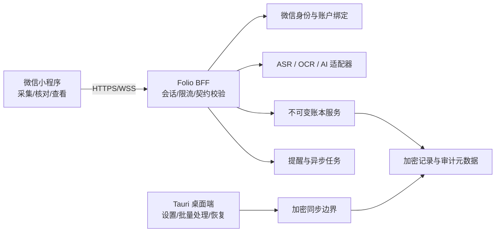

# Folio 微信小程序技术改造方案

状态：M0 架构基线，2026-08-11  
目标：把 Folio 的移动体验改造成可审核、可测试、可与桌面端共享数据的微信小程序 MVP。

## 1. 结论先行

微信小程序不是 Tauri 移动端的另一个打包目标，而是同一产品领域下的第二个运行时。M0 验证后的选定方案是：

- 新建无 npm 运行依赖的原生 WXML/JS 薄壳，不使用 WebView 或 DOM 模拟层承载关键流程；
- 抽取平台无关的财务领域规则、提案契约、Markdown 解析和设计 token；
- 将当前 Tauri 命令边界改造成可替换的端口，桌面端走本地 Rust，微信端走 HTTPS BFF；
- AI、ASR、OCR、微信登录、提醒调度和所有密钥只存在于服务端；
- 权威记录仍是不可变账本，AI 只能生成待核对提案；
- 小程序只承担日常采集、核对、查看和提醒，不在首版复制桌面端的批量导入、备份恢复和复杂持仓纠错。

## 2. 第一性原理

### 2.1 用户真正购买的不是“小程序页面”

普通用户的核心任务只有四个：

1. 随时说出或上传刚发生的财务变化；
2. 清楚看到 AI 理解成了什么；
3. 明确确认哪些内容可以写入；
4. 之后能可靠地看到余额、流水和提醒已经变化。

所以首版优先级是：采集成功率 > 核对清晰度 > 写入正确性 > 同步可靠性 > 页面数量。

### 2.2 钱的数据必须比 UI 生命周期更长

微信缓存可能被清理，小程序可能被删除，设备可能离线。因此：

- `wx.storage` 只能是可丢弃缓存，不能是系统记录；
- 每次确认必须由服务端以事务方式提交；
- 每次写入必须有 `proposalId`、`idempotencyKey`、`expectedVersion` 和用户确认范围；
- 网络重试、双击、回前台和重复回调不能产生重复流水。

### 2.3 AI 是不可信输入，不是记账权限

- 模型输出永远是 `pending_review`；
- 金额、账户、日期、币种、余额影响必须通过确定性校验；
- 模糊账户、多义金额、缺失日期和相互冲突的 OCR 证据全部 fail closed；
- 用户确认只确认选中的项目，未选项目不得静默写入；
- 模型供应商超时或更换不能改变账本语义。

### 2.4 客户端没有秘密

小程序包可以被下载和分析。微信 AppSecret、AI Key、OCR/ASR Key、数据库管理密钥和签名私钥不得进入客户端、构建变量或日志。客户端只持有短期会话和可撤销设备凭证。

### 2.5 跨端一致性优先于“代码复用率”

复用错误的 UI 代码会放大维护成本。真正需要共享的是：

- 金额和币种规则；
- 提案、确认、账本事件和错误码契约；
- Markdown 结构；
- 证据和审计字段；
- 设计 token 与品牌素材；
- 契约测试。

桌面 UI 与小程序 UI 可以分别实现，只要共享同一语义。

### 2.6 平台能力必须可替换

语音、OCR、模型和通知都通过端口调用，不让某一家云供应商渗入领域代码。人工尚未确定供应商时，开发使用 fake adapter 和录制响应推进。

## 3. 当前代码评估

| 当前部分 | 现状 | 改造决定 |
|---|---|---|
| `src/NativeVaultApp.jsx` | 超过一万行，包含页面、弹窗、语音、文件、设置和平台状态 | 不复制；逐步拆成页面/流程组件和共享 view-model |
| `src/styles.css` | Web DOM 选择器和桌面/移动响应式混合 | 抽 token；小程序样式独立实现 |
| `src/domain/*` | 纯 JS 金额、草稿、账本逻辑 | 抽为共享包并加性质测试 |
| `src/ai/voiceReview.js` | 已有语音稿分点核对逻辑 | 共享，但模型输出仍需服务端校验 |
| `src/services/import/*` | 结构化 Markdown 解析较独立 | 共享解析；文件选择和保存分别适配 |
| `src/data/local/localRepository.js` | 约 78 个 Tauri `invoke` 调用 | 定义 repository/port 契约；微信端实现 HTTP adapter |
| `src-tauri/*` | SQLCipher、Keychain、Apple Speech、Vision/PDFKit、Codex CLI | 桌面端保留；可复用的账本规则抽为 Rust core，服务端调用同一语义 |
| Recharts/Phosphor/SVG | 假设浏览器/SVG 运行时 | 图表改 Canvas；图标转静态资源或小程序兼容组件 |
| Blob/下载/file input | 假设浏览器和本地文件系统 | 改微信文件选择、临时文件、上传和分享适配器 |

## 4. 方案选型

| 方案 | 首版速度 | 原生能力 | 长期维护 | 结论 |
|---|---:|---:|---:|---|
| WebView 包装现有 Web | 快 | 弱 | 差 | 仅可做只读展示，不作为产品方案 |
| 原生 WXML/JS 薄壳 | 中 | 最强 | UI 需独立维护，但依赖面最小 | **MVP 选定** |
| Taro + React | 中 | 强 | 组件语法相似，但不能直接复用 DOM UI | M0 spike 未通过依赖安全和版本门禁 |

第一性原理优化后，不再追求“同一套 React 组件跑三端”。Folio 需要共享的是金额语义、提案/确认契约、证据和幂等规则；页面只是平台薄壳。Taro 4.2.1 spike 的 `@tarojs/react` 要求 React `^18`，与当前桌面端 React 19.2 不一致；官方默认模板安装 1509 个包，当时生产依赖审计仍报告 7 个 critical 和 1 个 high。因此 MVP 使用无 npm 运行依赖的原生 WXML/JS；等 Taro 同时通过 React 19、生产依赖和真机性能门禁后再重评估。

## 5. 目标架构



### 5.1 小程序客户端

- 页面：解锁、总览、统一采集、核对、资产、流水、提醒、设置；
- 只调用 Folio BFF，不直接调用模型或数据库；
- 保存加密缓存、短期会话、上传中的临时状态；
- 维护离线草稿队列，但确认写入必须在线；
- 所有金额改变显示明确的待确认/已确认状态。

### 5.2 BFF

- `wx.login` code 交换和 Folio 会话；
- 账号绑定、撤销设备、重新认证；
- 请求签名、限流、幂等、防重放；
- 生成短期上传凭证；
- 编排 ASR/OCR/AI，但不信任供应商输出；
- 返回稳定的 Folio 错误码，不把供应商错误直接暴露给客户端；
- 日志默认脱敏，不记录原始语音、完整财务文档或密钥。

开发/冒烟测试阶段允许 BFF 通过服务端环境变量读取 DeepSeek 凭证，调用其 `/chat/completions` 和 JSON Output 进行语义整理。该 adapter 必须与 OpenAI Responses/Codex CLI 适配器分离；手机或小程序只接收 Folio 提案，不接收、保存或透传 DeepSeek Key。Codex CLI 仍只用于桌面 Demo。

### 5.3 权威账本与同步

- 服务端确认事务写入不可变事件；
- 账户、持仓、流水、提醒按依赖顺序同步；
- 桌面端与微信端都通过版本向量/游标发现冲突；
- 冲突进入核对，不以最后写入覆盖；
- 今日新增/更新依据服务端持久化时间，并按用户本地日期显示。

### 5.4 AI 采集流水线

```text
用户输入
→ 临时证据（语音帧/图片/PDF/文字）
→ ASR/OCR
→ AI 语义整理
→ 确定性规则与证据覆盖校验
→ pending_review
→ 用户逐项确认
→ 原子提交账本
→ 删除临时原件
```

## 6. 功能范围

### 小程序 MVP 必须有

- 微信登录、Folio 账户绑定、应用密码解锁；
- 总览、资产摘要、最近流水、近期提醒；
- 文字、语音、截图采集；
- 实时语音部分转写和“结束并核对”；
- 分点核对、逐项选择、明确确认；
- 今日新增/更新；
- 手动锁定；
- 订阅提醒状态；
- 跨端同步、冲突提示、错误恢复；
- 隐私指引、数据导出/删除申请入口、AI 生成标识。

### 首版暂缓

- 大批量 PDF/Excel/Numbers 导入；
- 加密备份恢复；
- QQ 邮箱同步；
- 复杂持仓操作和历史冲正 UI；
- 完整规划沙盘；
- 自动投资、自动调仓和任何收益承诺；
- 小程序内自由活动桌宠。

## 7. 代码组织

```text
apps/
  wechat-mini/          # 原生 WXML/JS 页面、微信 API adapter
packages/
  folio-contracts/      # 提案、确认、错误码、端口契约
  folio-domain/         # 金额、账本、提醒、Markdown 规则
  folio-design/         # token、图标映射、品牌资源索引
services/
  folio-bff/            # 微信登录、会话、供应商编排
  folio-ledger/         # 权威确认和同步接口
```

在未完成 M0 架构验证前，不移动现有 `src/` 与 `src-tauri/`，避免破坏已可运行的 macOS 版本。

## 8. 接口契约

每个写操作至少携带：

```json
{
  "proposalId": "opaque-id",
  "expectedVersion": 17,
  "idempotencyKey": "device-generated-uuid",
  "confirmedItemIds": ["item-1"],
  "confirmedByUser": true
}
```

服务端不得接受：

- `confirmedByUser !== true`；
- 空确认范围；
- 缺失/重复的幂等键；
- 已过期或已消费提案；
- 版本落后的余额修改；
- 没有来源证据的 AI 项目；
- 客户端直接传入“最终余额”绕过事件规则。

## 9. 里程碑

### M0｜架构与契约基线（3–5 个开发日）

交付：

- 本方案、测试方案、人工堵点清单；
- `folio-contracts` 最小共享包；
- 客户端无密钥检查；
- 提案/确认/端口契约测试；
- Taro/React/Canvas/包体 spike 的决策记录；
- 无依赖原生游客模式壳层与 Canvas 验证页。

退出标准：现有测试不回归；契约测试全绿；没有引入云供应商锁定；技术栈 ADR 明确。

### M1｜小程序只读壳层（5–8 个开发日）

交付：登录占位、解锁、总览、资产、流水、提醒、设置；使用虚构 fixture；自定义 tabBar；品牌 token。

退出标准：微信开发者工具、真实 iPhone、真实 Android 均可打开；主包小于平台限制并预留 30% 余量；无真实财务数据。

### M2｜身份、安全与账户绑定（7–10 个开发日）

交付：微信登录 BFF、短期会话、桌面绑定码、应用密码、手动锁、撤销设备、无密钥客户端。

退出标准：伪造 code、重放、会话过期、设备撤销和错误密码测试通过；日志无敏感数据。

### M3｜统一采集与 AI 核对（8–12 个开发日）

交付：文字、语音、截图；流式转写；OCR；AI 提案；分点核对；结束/取消；临时文件删除。

退出标准：AI 不能直接写账；每项有证据；权限拒绝、网络中断、乱序语音帧和恶意文档测试通过。

### M4｜账本提交与跨端同步（8–12 个开发日）

交付：幂等确认、不可变事件、桌面/微信同步、冲突核对、今日新增/更新。

退出标准：双击、重试、离线恢复、并发修改不产生重复或静默覆盖；账本守恒性质测试通过。

### M5｜提醒与订阅消息（5–7 个开发日）

交付：提醒管理、订阅授权、服务端调度、当前期次完成、下一期推进、通知状态降级。

退出标准：拒绝订阅不破坏应用内提醒；重复回调不重复推进；锁屏消息不含账户和金额。

### M6｜合规、性能与发布（7–12 个开发日，不含人工审核等待）

交付：隐私/用户协议、AI 标识、账号注销、数据导出删除、分包、监控、灰度、回滚、提审材料。

退出标准：零未关闭 S0/S1；核心路径无未豁免 S2；备案、类目、域名、隐私和 AI 材料完成；体验版真实用户验收。

## 10. 架构决策记录

### ADR-001：拒绝 WebView 作为产品主方案

理由：无法可靠复用本地加密、原生语音、文件、通知和审核边界；只转移问题，不降低系统复杂度。

### ADR-002：AI 只生成提案

理由：模型不可重复、不可审计且会幻觉，不能成为金钱系统写权限。

### ADR-003：小程序缓存不是系统记录

理由：容量有限且可被系统或用户清除。

### ADR-004：服务端供应商可替换

理由：ASR/OCR/LLM 的价格、地域、资质和可用性都会变化。

### ADR-005：小程序是日常入口，桌面端是设置/批量/恢复端

理由：匹配平台优势，同时控制首版范围。

### ADR-006：MVP 小程序选择原生薄壳，不引入 Taro

决策与量化证据见 [`ADR-006-NATIVE-WECHAT-SHELL.md`](./ADR-006-NATIVE-WECHAT-SHELL.md)。结论可以在依赖和真机门禁改善后重新审查，但不得为了组件复用降级桌面端 React。

## 11. 关键风险与预案

| 风险 | 影响 | 预案 |
|---|---|---|
| React/Taro 兼容失败 | 延误 UI | M0 spike；失败即回退原生 WXML，不改变领域/BFF |
| 微信类目与财务文案被拒 | 无法上线 | 开发前人工确认类目与资质；保持“整理/记账/提醒”定位 |
| AI/ASR 数据出境 | 合规与审核风险 | 人工决定部署地域和供应商；默认境内处理，最小化上传 |
| 模型幻觉或 OCR 冲突 | 错账 | 证据覆盖、确定性校验、逐项确认、fail closed |
| 订阅消息不可用 | 漏提醒 | 应用内提醒为主，订阅消息只作增强 |
| 客户端被逆向 | 密钥泄露 | 客户端无秘密、短会话、服务端限流和签名 |
| 双端并发修改 | 数据分叉 | 版本检查、不可变事件、冲突核对 |
| 小程序被删除/缓存清理 | 本地数据丢失 | 服务端权威记录、加密缓存可重建 |

## 12. 官方约束参考

- [微信分包加载与包体限制](https://developers.weixin.qq.com/miniprogram/dev/framework/subpackages.html)
- [微信登录流程](https://developers.weixin.qq.com/miniprogram/dev/framework/open-ability/login.html)
- [微信本地存储](https://developers.weixin.qq.com/miniprogram/dev/api/storage/wx.setStorage.html)
- [微信录音管理器](https://developers.weixin.qq.com/miniprogram/dev/api/media/recorder/wx.getRecorderManager.html)
- [微信网络与 HTTPS/WSS](https://developers.weixin.qq.com/miniprogram/dev/framework/ability/network.html)
- [微信用户隐私保护指引](https://developers.weixin.qq.com/miniprogram/dev/framework/user-privacy/)
- [微信订阅消息](https://developers.weixin.qq.com/miniprogram/dev/framework/open-ability/subscribe-message.html)
- [工信部移动互联网应用程序备案通知](https://www.miit.gov.cn/zwgk/zcwj/wjfb/tz/art/2023/art_920db564162e4312916a01bed6540ad8.html)
- [人工智能生成合成内容标识办法](https://www.cac.gov.cn/2025-03/14/c_1743654684782215.htm)
